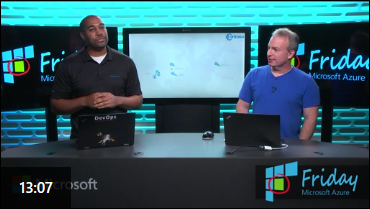

# Azure Container Registry Roadmap

The Azure Container Registry ([ACR][acr]) is central to image and [artifact][artifacts-repo] management within Azure.

**ACR provides:**

* Network-close registry access, providing the fastest and most reliable storage of images, close to your Azure deployments. For more info: [Choosing a Docker Container Registry](https://stevelasker.blog/2018/11/14/choosing-a-docker-container-registry/)
* [Integrated security][acr-auth] to your Azure Active Directory accounts, enabling your company to control access to your collection of images
* [Geo-replication][geo-replication], provides single registry/image/tag names, that can be used across multiple regions

* [VNet and Firewall Rules][vnet], securing registries from public endpoints.
* [Tasks][tasks] for building, patching, testing container workloads
* [Scheduled Tasks][scheduled-tasks] for automating tasks, such as automatically purging older artifacts
* [Webhook Notifications][webhooks] for event based notifications of content pushed and/or deleted
* [OS & Framework Patching][os-fx-patching], using [ACR Tasks][tasks]
* [Helm Chart][helm] support, as the beginning or [OCI Artifact][artifact-docs] support.
* [Quarantine Pattern][quarantine] (*private preview*), providing secure by default registries
* [Anonymous Pulls][public-repos] (*preview*), - aka public registries.
* [Content Trust][content-trust] for assuring the delivery of an image from ACR to its destination.

To provide insight to our backlog, we wanted to provide the high level list of experiences we're enabling. While not a complete list, it should provide some insight to what's coming, what's a bit further out and the thought process behind our prioritization.

## Ordering of Priority

Containers have grown exponentially over the last few years. As a result, the ecosystem continues to grow. There are many great partners doing innovative and required work. Our goals for ACR is to work with, not compete with registry partners. We believe ACR can provide the best base experience in Azure, as ACR can integrate core capabilities required to run in Azure. While partners can build atop the [OCI Distribution Spec][distribution-spec].

As a result, we're working with partners to integrate with ACR, providing any necessary features they need to provide their additional capabilities. As an example, [Web Hook notifications][webhooks] allow vulnerability scanning partners to respond to events, rather than scheduled jobs for detecting new/updated images requiring scanning. [VNet & Firewall Rules][vnet] enables core capabilities of Azure, other registries would be unable to provide.

As we look to our backlog, there's a long list of scenarios we're working to enable. They break down into 5 categories:

1. Operational Health & Support
1. Must Haves to enable basic registry access
1. Must Haves, but possibly with partner integration
1. Primitives that must be done within the core registry
1. Innovative/differentiating features that require core registry changes

As a result, there are a set of features we know customers have come to expect from a registry, such as image vulnerability scanning and we are working to enable those, even if just links into the Azure Marketplace. While there are a set of features that require deeper integration, such as `az acr login -r [yourregistry]` enabling your individual Azure Identity to access your your collection of images, [VNet & Firewall Rules][vnet] or core performance work.

## Backlog

The following items are in our backlog. Some are in active development. The majority of our backlog items source from users, via [uservoice][uservoice].

* [Vulnerability Scanning Updates](#vulnerability-scanning-updates)
* [Limit Endpoint Access /VNet Support](#limit-endpoint-access-vnet-support)
* [When will ACR VNet support GA](#when-will-acr-vnet-support-ga)
* [Tokens & Repository Scoped Permissions (RBAC)](#tokens--repository-scoped-permissions-rbac)
* [Diagnostics & Monitoring](#diagnostics--monitoring)
* [Health Checks](#health-checks)
* [Auto Purge](#auto-purge)
* [ACR Helm GA](#acr-helm-ga)
* [Performance & Scalability](#performance--scalability)
* [Container Build Caching with ACR Tasks and BuildX](#container-build-caching-with-acr-tasks-and-buildx)
* [Helping with Prioritization](#helping-with-prioritization)

### Vulnerability Scanning Updates

We've heard customers tell us that vulnerability scanning is table stakes for container registries. We agree. With partners like Aqua and TwistLock, customers can get the must-haves complete, today. ACR provides launch points to the Azure Marketplace, helping customers integrate vulnerability scanning.

Starting fall '19, [Azure Security Center][asc] will start offering registry scanning and runtime protection. As with any new offering, it will take time for us to dial in the experiences.

We believe customers should have a choice for their security scanning solutions and will continue to provide extensibility, just as users can choose the security scanning of their users machines and their servers.

### Limit Endpoint Access /VNet Support

Customers have asked for limitations on their registry, based on the IP, not just authentication. As a shared registry API, this does present some challenges that we're incrementally addressing.

In [March of 2019 we added preview support for VNet and Firewall rules](https://azure.microsoft.com/en-us/blog/azure-container-registry-virtual-network-and-firewall-rules-preview-support/). This allows customers to limit their acr endpoint to requests from within the defined Azure VNet, or any whitelisted ip ranges. ACR VNet support is supported with AKS and VMs hosting container images. The container host infrastructure must be placed within the customers VNet as the host must be able to pull the image, from the registry that's in the VNet.

For container hosts that are not within the customers Azure VNet, such as multi-tenant services like Azure ML, ACI, Azure DevOps hosted build agents and ACR Tasks, the host is unable to pull the image. The host can only pull the image if it's in the VNet. We refer to this as the bootstrapping problem.

We are actively working with service teams to identify a secure solution that adherers to the promise that a customers VNet is secured to only the resources they place in that VNet.

#### When will ACR VNet support GA

When customers ask; when will __ ga, we typically here the following questions:

1. **Q: Will the capability actually ship, or is it an experiment?**  
  **A**: VNet will ship - it's not an experiment.
1. **Q: If I write automation, will the control plane or data plane apis have breaking changes?**  
  **A**: We are unable to commit to non-breaking changes in the CLI or REST apis at this time.
1. **Q: When can I get support?**  
We are engaging a subset of customers in preview support. Contact acr-sup@microsoft.com, requesting VNet Preview support if you are interested.
1. **Q: What is the SLA? Are there any SLAs for something prior to GA?**  
We have not provided an SLA for VNet as of yet. If you are blocked adopting ACR VNet without GA, please contact us (acr-sup@microsoft.com), requesting VNet Preview support.

As for when VNet & Firewall rules will ga:

Any new feature needs bake time to work out the bugs, performance bottlenecks, usability gaps and incorporate customer feedback. While we typically aim for a 6 month window between preview and GA, this is an estimate based on the complexity of the capability. VNets, due to the security implications, is something we prioritize stability over a committed time frame. We do not have an ETA for GA at this time. We encourage customers to use ACR VNet support, [providing feedback][feedback] or through [acr support](acr-support@microsoft.com)

### Tokens & Repository Scoped Permissions (RBAC)

One of the top requests has been [UserVoice: Configure permissions at a repository level](https://feedback.azure.com/forums/903958-azure-container-registry/suggestions/31655977-configure-permissions-at-a-repository-level). We also have frequent requests for token based permissions, as service principals can provide access to other resources in Azure that customers may not be comfortable with. There's also a max number Service Principals and Managed Identities that can be provisioned within a subscription, and customers have faced challenges with [AAD timeouts](https://feedback.azure.com/forums/903958-azure-container-registry/suggestions/36027793-extend-token-lifespan-of-az-acr-login).

As customers use containers, and other [artifacts][artifacts-repo], for their IoT deployment, the number of devices can grow to the millions.

To support the scale of IoT, ACR is implementing repository based RBAC, using tokens. This feature is under development, with a hopeful preview in the fall of 2019. In a subsequent release, tokens can be backed by service principals and AAD users, enabling RBAC with SPs, Managed Identities and Users.

### Diagnostics & Monitoring

Customers looking to troubleshoot why their push/pull operations are either failing or are too slow wind up contacting Azure Support, just to troubleshoot basic information. In the fall of '19, ACR will be shipping Diagnostics and Logs support.

#### Health Checks

Customers looking to test their connectivity to their ACR can use [az acr health-check][health-check]

### Auto Purge

As registries are filled with automated image builds, they wind up filling with tags, manifests and layers that never get used, or were deployed for a period of time, but no longer. [Auto-purge-spec](https://github.com/AzureCR/specs/issues/1) outlines how ACR will track image usage and move unused layers to a recycle bin, allowing subsequent purging. The feature will be configured and managed, with reasonable defaults, assuring you'll never lose anything you really wanted to keep.

As a step along this automated journey, [ACR Scheduled Tasks][scheduled-tasks] and a new ACR image (mcr.microsoft.com/acr/acr-cli:0.1) can be used to [automate image deletion][auto-purge].

### ACR Helm GA

**Q: When will ACR Helm Support GA?**  
With the collaboration of [Josh Dolitsky](https://jdolitsky.io), of [Chart Museum](https://chartmuseum.com), we added [Helm 2][helm] support to ACR - `az acr helm`. As we watched the industry look for **Y**et **A**nother **S**torage **S**olution (YASS) for new types like [Singularity][singularity], [CNAB](https://cnab.io/) and other new types, we realized we needed a more generalized solution. With help from people like [Stephen Day](https://www.linkedin.com/in/stephenjday/) and the [OCI community][oci-org], we focused on [creating a generalized Artifacts store](https://stevelasker.blog/2019/01/25/cloud-native-artifact-stores-evolve-from-container-registries/). In August of '19, the [OCI TOB](https://github.com/opencontainers/tob/pull/60) adopted [OCI Artifacts][artifacts-repo].

With OCI Artifacts in place, we are working with the [Helm Community](https://github.com/helm/) to add [Helm Registry support](https://v3.helm.sh/docs/topics/registries/), allowing customers to use `helm registry push|pull|` across all OCI compliant Registries. As Helm 3 Registry support releases, and the community moves to Helm 3, our plan is to deprecate the Helm 2 acr support for, what we believe is a more native Helm 3 experience. We will continue to support `az acr helm` support for a period of transition to Helm 3. All Helm charts pushed to ACR with `az acr helm` will be fully compatible with Helm 3 registry support. Customers using ACR Helm should be comfortable with a smooth transition to Helm 3 and continue with `az acr helm` in the meantime.

### Performance & Scalability

As customers move from manual deployments to automation, we've seen a dramatic increase in usage. Some customers care using utilities like [Watch Tower](https://github.com/v2tec/watchtower) to automate `docker pull`, keeping your deployments up to date, while others are simply doing massive scaling.

When issuing `docker pull` a manifest is returned, listing the layers required. If the local host already has the layers, no additional requests are made. However, the registry must still respond with the manifest. ACR introduced a caching layer to cache & return manifest without having to hit storage. We should mention that an alternative approach would be to use [Web Hooks][webhooks] to know when an image has been updated, rather than simply asking the registry: *"do you have anything new, do you have anything new, do you have anything new..."*.
We've also been working with a few high profile customers to scale thousands of nodes, each pulling large images. We recently scaled 1,000 nodes in 10 minutes with 11 terabytes being deployed. This performance work has been moved into the Premium SKU to enable high scale customers a solution to their larger needs. We continue to focus on concurrent throughput and individual pull performance scenarios.

### Container Build Caching with ACR Tasks and BuildX

When building locally, `docker build` benefits from image caching. This works as the machine is dedicated to the user, along with its disk. As users leverage cloud builds, they want the same build cache performance, without having to pay for dedicated compute, just waiting for builds. ACR released [BuildX] integration with [ACR Tasks][acr-buildx] as a preview to first class integration. We hope to have something as simple as `--cache` as a parameter to tasks, soon.

## Helping with Prioritization

Have a request, or wish we were doing something; Please provide your feedback and ranking to help us understand your needs and priority through [UserVoice][uservoice].

[acr]:                      https://aka.ms/acr
[asc]:                      https://azure.microsoft.com/services/security-center
[acr-auth]:                 https://aka.ms/acr/authentication
[artifact-docs]:            https://aka.ms/acr/artifacts
[artifacts-repo]:           https://github.com/opencontainers/artifacts
[acr-buildx]:               https://aka.ms/acr/buildx
[auto-purge]:               https://aka.ms/acr/auto-purge
[buildx]:                   https://github.com/docker/buildx
[content-trust]:            https://aka.ms/acr/content-trust
[distribution-spec]:        https://github.com/opencontainers/distribution-spec
[feedback]:                 https://aka.ms/acr/feedback
[geo-replication]:          https://aka.ms/acr/geo-replication
[helm]:                     https://aka.ms/acr/helm-repos
[health-check]:             https://aka.ms/acr/health-check
[oci-org]:                  opencontainers.org/
[os-fx-patching]:           https://docs.microsoft.com/en-us/azure/container-registry/container-registry-tutorial-base-image-update
[public-repos]:             https://aka.ms/acr/public-repos
[quarantine]:               https://aka.ms/acr/quarantine
[scheduled-tasks]:          https://aka.ms/acr/tasks/scheduling
[singularity]:              https://archive.sylabs.io/
[skus]:                     https://aka.ms/acr/skus
[tasks]:                    https://aka.ms/acr/tasks
[uservoice]:                https://aka.ms/acr/uservoice
[vnet]:                     https://aka.ms/acr/vnet
[webhooks]:                 https://docs.microsoft.com/azure/container-registry/container-registry-webhook
