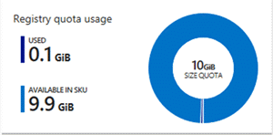
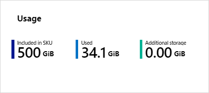

# Azure Container Registry Roadmap #
The Azure Container Registry (ACR) is central to image management within Azure. ACR provides:
* network-close registry access, providing the fastest and most reliable storage of images, close to your Azure deployments
* integrated security to your Azure Active Directory accounts, enabling your company to control access to your collection of images

To provide insight to our backlog, we wanted to provide the high level list of experiences we're enabling. While not a complete list, it should provide some insight to what's coming, what's a bit further out and the thought process behind our prioritization.

We've also added some of the recently completed items. 

## Ordering of Priority ##
Docker containers have grown exponentially over the last few years. As a result, the ecosystem continues to grow. There are many great partners doing innovative and required work. Our goals for ACR is to work with, not compete with registry partners. We believe ACR can provide the best base experience in Azure, as ACR can integrate core capabilities required to run in Azure. While partners can build atop the common OSS Docker Registry. 

As a result, we're working with partners to integrate with ACR, providing any necessary features they need to provide their additional capabilities. Web Hook notifications allow vulnerability scanning partners to respond to events, rather than scheduled jobs for detecting new/updated images requiring scanning. 

As we look to our backlog, there's a long list of scenarios we're working to enable. They break down into 4 categories:

* Must Haves to enable basic registry access
* Must Haves, but possibly with partner integration
* Primitives that must be done within the core registry
* Innovative/Differentiating features that require core registry changes

As a result, there are a set of features we know customers have come to expect from a registry, such as image vulnerability scanning and we are working to enable those, even if just links into the Azure Marketplace. 
While there are a set of features that require deeper integration, such as ` az acr login -r [yourregistry] ` enabling your individual Azure Identity to access your your collection of images

## Completed Items ##
Since posting our backlog, we wanted to provide an update on completed work, and updated priorities.

### Helm Chart Repos

ACR now supports pulling and pushing [Helm Charts](Helm.io) directly to your Azure Container Registry. By using ACR, charts are secured and geo-replicated alongside the images they reference. 

To get started: [ACR Helm Chart Repo documentation](https://aka.ms/acr/helm-repos)

### The Donut is Dead

ACR Registries used to have upper limits on the amount of images that could be pushed to each registry. While we [removed this constraint](https://stevelasker.blog/2018/02/02/relaxing-acr-storage-limits-with-tools-to-self-manage/) a while back, we were still showing a donut for the current amount of storage. 

This was just confusing, and we joked about making it an overflowing cupcake. We settled on simply showing just the facts:

### Image Promotion ###
We're starting to see a pattern where teams use multiple registries that align to their environments. The Dev team has a registry they develop, build, test within. The entire development team has full access to push and pull. The production environment is locked down to a subset of users and service accounts. It has only the images that have passed quality testing. It may be the registry that gets geo-replicated, where the dev registry is limited to the region(s) where developers work/deploy to. 

Through [ACR Import](https://docs.microsoft.com/en-us/cli/azure/acr?view=azure-cli-latest#az-acr-import) teams can now promote an image from one registry to another. 

### Sovereign and Government Clouds ###
ACR Preview is now available in [Azure China](https://www.azure.cn/home/features/container-registry/) and [Azure Government Clouds](https://azure.microsoft.com/en-us/global-infrastructure/government/). 

### Trusted Registries ###
As customers sign their images, [ACR now supports docker content trust.](https://aka.ms/acr/content-trust)

### General Availability of Managed Registries ###
Basic, Standard and Premium SKUs went GA the week of October 16th, 2017. Managed registries include Individual Identity, Web Hook Notifications and Delete capabilities. 
A new [SKUs](http://aka.ms/acr/skus) doc explains the various SKUs.

### Geo-replication ###
[A preview of Geo-replication](http://aka.ms/acr/geo-replication) rolled out the week of October 24th, 2017 with the [Announcement of Managed Kubernetes in Azure with AKS.](https://azure.microsoft.com/en-us/blog/introducing-azure-container-service-aks-managed-kubernetes-and-azure-container-registry-geo-replication/) ACR now supports the ability to manage a single registry across multiple regions. Leveraging a single configuration for authorizations and a common image uri. 

### Sku Migration ###
Classic Container Registries are being deprecated on March 1st 2019. 

Please see [Migration from Classic to Basic/Standard/Premium takes a long time and/or fails](https://github.com/Azure/acr/issues/67)

### Vulnerability Scanning Integration ###
We've heard customers tell us that vulnerability scanning is table stakes for container registries. We agree. We will have an [Azure Security Center](https://azure.microsoft.com/services/security-center/) container solution in time. The exact timeline is not yet confirmed. Just as Windows comes with Defender, which can be changed for other scanning solutions, ACR will also support a default and partner plug-ins. It just so happens we're leading with partners like Aqua and TwistLock. With great partners, customers can get the must-haves complete. 

ACR provides launch points to the Azure Marketplace, helping customers integrate vulnerability scanning. Over time, we will make this more integrated into ACR. This is one of those features we can unblock customers wih an experience, while focusing our engineering efforts on things only our engineering team can complete - like geo replication and perf & scale. 

### Auto-Build with OS & Framework Patching ###
Containers include a portion of the base OS & Development Framework. As base image updates are available, customers need a means to be notified, having their images rebuilt. This involves a number of primitives, such as web hooks and base image caching. It also requires a scalable, multi-tenant infrastructure to build images as they get updated. Using multi-stage dockerfiles, a connection to your git repo, customers will be able to hook automated builds, which can also trigger tests to enable automated workflows. 

[ACR Tasks](https://aka.ms/acr/tasks) are now released.

There are many additions that will come, including perf improvements and the ability to branch off production workloads while developers continue to iterate. 

## Backlog ##

### Limit Endpoint Access /VNet Support ###
Customers have asked for limitations on their registry, based on the IP, not just authentication. As a shared registry API, this does present some challenges that we'll need to address. 

We currently have VNet and Firewall rules available in private preview. Please contact us at acrsup@microsoft.com for being added to the VNet Private Preview. 

### Auto Purge ###
As registries are filled with automated image builds, they wind up filling with layers that never get used. Auto-purge will track image usage and move unused layers to a recycle bin, allowing subsequent purging. The feature will be configured and managed, with reasonable defaults, assuring you'll never lose anything you really wanted to keep. 

For input into the Auto Purge Spec, please comment here: [Open discussion on Auto-Purge Policies design #1](https://github.com/AzureCR/specs/issues/1)

### Performance & Scalability ###
As customers move from manual deployments to automation, we've seen a dramatic increase in usage. Some customers care using utilities like [Watch Tower](https://github.com/v2tec/watchtower) to automate ` docker pull `, keeping your deployments up to date, while others are simply doing massive scaling. 
When issuing `docker pull` a manifest is returned, listing the layers required. If the local host already has the layers, no additional requests are made. However, the registry must still respond with the manifest. ACR introduced a caching layer to cache & return manifest without having to hit storage. We should mention that an alternative approach would be to use Web Hooks to know when an image has been updated, rather than simply asking the registry: *"do you have anything new, do you have anything new, do you have anything new..."*.
We've also been working with a few high profile customers to scale thousands of nodes, each pulling large images. We recently scaled 1,000 nodes in 10 minutes with 11 terabytes being deployed. This performance work is being moved into the Premium SKU to enable high scale customers a solution to their larger needs.

### Portal Face Lift ###
As we add more and more features, the current user flow is starting to suffer. We'll be reworking the flow to support a host of new enhancements we're working on over the next few months.

### User Telemetry ###
As your registry usage increases through automation, providing visibility into the usage and image size utilization.

### Multi-Arch Support ###
Building multi-arch images is typically associated with a few set of images that framework vendors must maintain, such as dotnetcore which supports both Linux and Windows. However, as IoT expands, the average developer will need to build multi-arch images to deal with the vast number of architectures supported by devices. ACR will support the automated building and maintaining of multi-arch manifests. 

### Custom Domain Support ###
Rather than using https://contoso.azurecr.io, you want https://registry.contso.com. 
In the spirit of what can be done without direct changes to ACR, we've provided a [doc on configuring an NGINX front end](https://github.com/Azure/acr/tree/master/docs/custom-domain). Over time, we will incorporate more native support for custom domains, and likely join in the limit endpoint access request as well.  

# Helping with Prioritization #
We've recently enabled [UserVoice](https://feedback.azure.com/forums/903958-azure-container-registry) for ACR. Please provide your feedback and ranking to help us understand your needs and priority.
