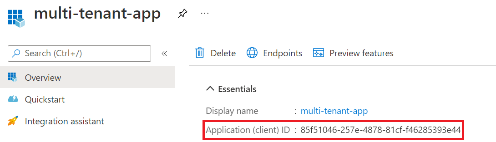
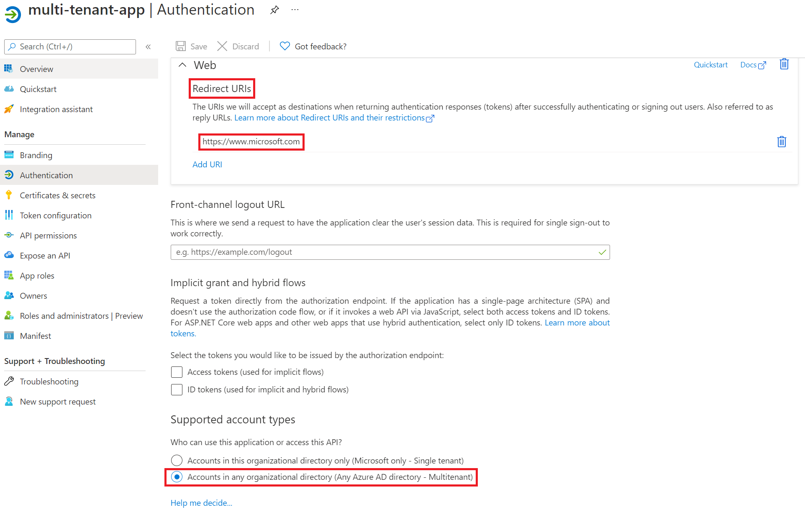
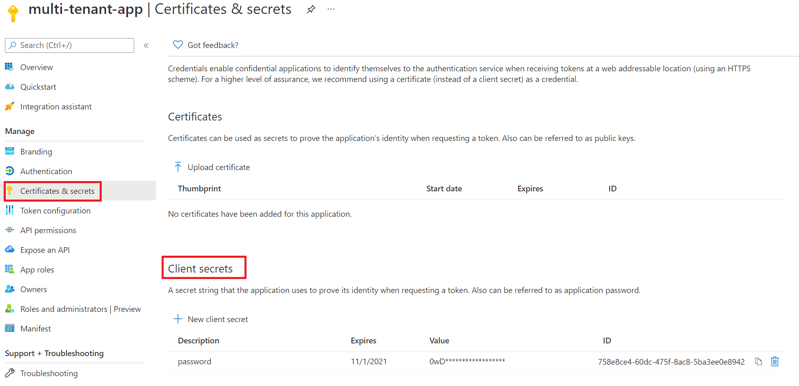
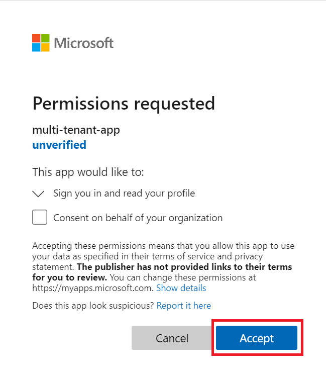
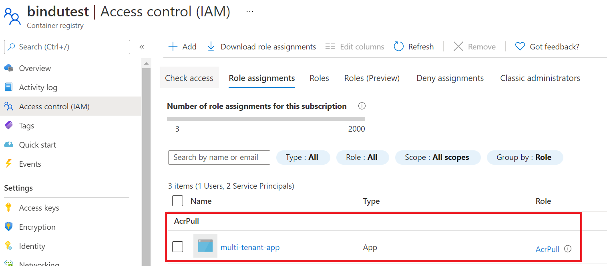

# Set up AKS to pull from ACR in a different AD tenant

## Introduction

There are several ways to set up the auth credential in Kubernetes to pull image from ACR. For example, you can use [admin user or repository scoped access token](https://docs.microsoft.com/en-us/azure/aks/kubernetes-service-principal) to configure pod [imagePullSecrets](https://kubernetes.io/docs/tasks/configure-pod-container/pull-image-private-registry/). 

While `imagePullSecrets` is commonly used, it brings the challenge and overhead to manage the corresponding secret. On Azure, you can set up [AKS cluster with a service principal credential](https://docs.microsoft.com/en-us/azure/aks/kubernetes-service-principal) which allows you securely pull the image from ACR without additional `imagePullSecrets` setting on each pod.

Sometimes, you may have your AKS and ACR in different Azure Active Directories (Tenants). This document will walk your through the steps to enable cross tenant authentication using service principal credential.

## Instruction

In this example, the AKS cluster is in `Tenant A` and the ACR is in `Tenant B`.

`Tenant A` is also the service principal home tenant.

You will need the contributor role of AKS subscription and the owner role of ACR subscription.

### Step 1: Enable multi-tenant AAD Application

- Login [Azure portal](http://portal.azure.com/) in `Tenant A` and go to Azure Active Directory `App registrations` blade to find the service principal application object. 

- Remember the `Application (client) ID` (it will be used in `step 2` and `step 4`)

    

- Choose multitenant account type as the following screenshot and also remember the `redirect url` (it will be used in step 2).

    

- Create a client secret if not exist (It is __IMPORTANT__ to make sure you use this client secret to update AKS in `step 4`).

    


### Step 2: Provision the service principal in ACR Tenant

- Open the following link with the Tenant B admin account and accept the permission request.

    ```
    https://login.microsoftonline.com/<ACR Tenant ID (Tenant B)>/oauth2/authorize?client_id=<Application (client) ID>&response_type=code&redirect_uri=<redirect url>
    ```

    

### Step 3: Grant service principal ACR image pull permission

- Assign AcrPull role to the service principal

    

### Step 4: Update AKS with the AAD Application secret

- Use the `Application (client) ID` and `client secret` collected in `step 1` to [update AKS service principal credential](https://docs.microsoft.com/en-us/azure/aks/update-credentials#update-aks-cluster-with-new-service-principal-credentials).

## Reference

- [Application and service principal objects in Azure Active Directory](https://docs.microsoft.com/en-us/azure/active-directory/develop/app-objects-and-service-principals)


 
