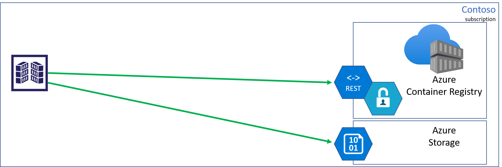
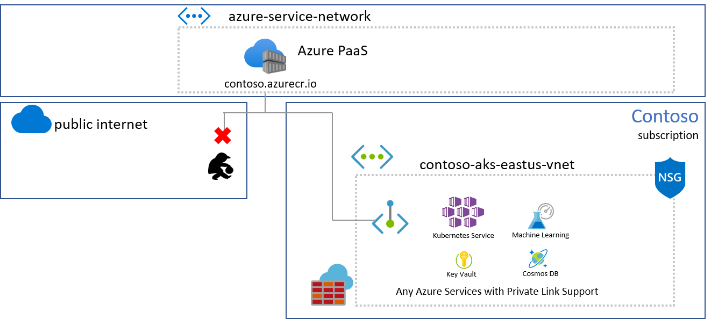
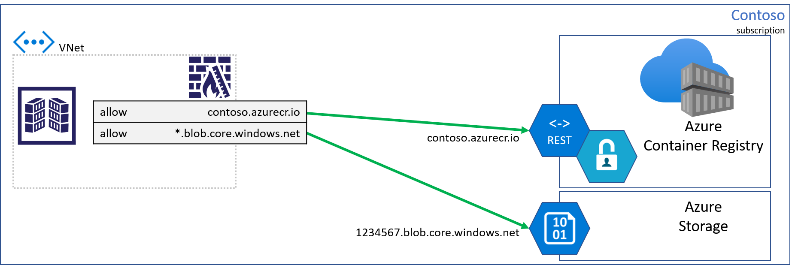
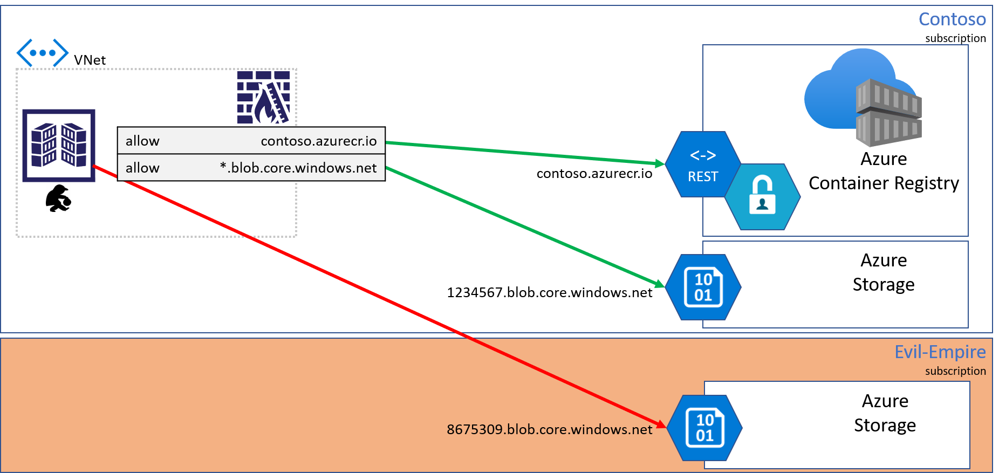
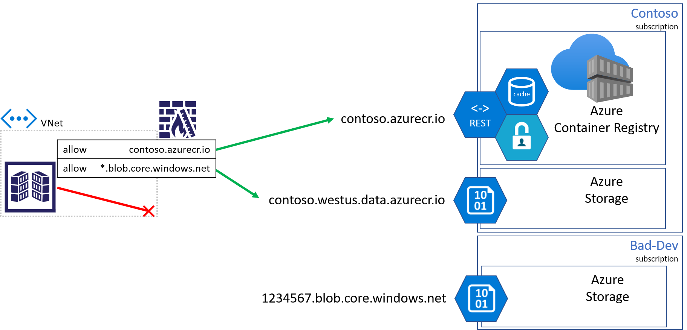
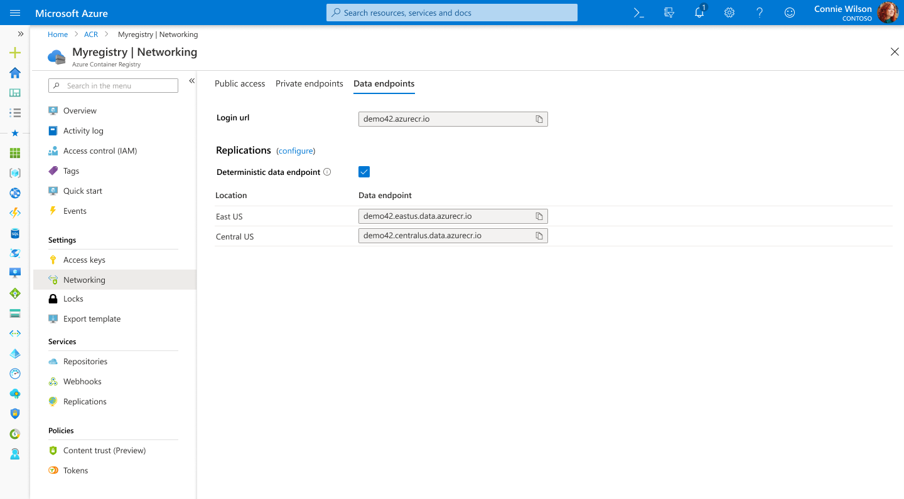

# Azure Container Registry: Dedicated Data Endpoints – Mitigating Data Exfiltration

Azure Container Registry announces dedicated data-endpoints, enabling tightly scoped client firewall rules to specific registries, minimizing data exfiltration concerns.

Pulling content from a registry involves two endpionts:

- **Registry endpoint**, often refereed as the *login url*, used for authentication and content discovery.  
  A command like `docker pull contoso.azurecr.io/hello-world` makes a REST request which authenticates and negotiates the layers which represent the requested artifact.
- **Data-endpoints** serve blobs representing content layers.



## Registry Managed Storage Accounts

Azure Container Registry is a multi-tenant service, where the data-endpoint storage accounts are managed by the registry service. There are many benefits for managed storage, such as load balancing, contentious content splitting, multiple copies for higher concurrent content delivery, and multi-region support with [geo-replication](https://aka.ms/acr/geo-replicatin).

## Azure Private Link VNet Support

Azure Container Registry recently announced [Private Link support](https://aka.ms/acr/privatelink), enabling private endpoints from Azure VNets to be placed on the managed registry service. In this case, both the registry and data-endpoints are accessible from within the VNet, using private IPs.

The public endpoint can then be removed, securing the managed registry and storage accounts to access from within the VNet.



Unfortunately, VNet connectivity isn’t always an option.

## Client Firewall Rules & Data Exfiltration Risks

When connecting to a registry from on-prem hosts, IoT devices, custom build agents, or when Private Link may not be an option, client firewall rules may be applied, limiting access to specific resources.



As customers locked down their client firewall configurations, they realized they must create a rule with a wildcard for all storage accounts, raising concerns for data-exfiltration. A bad actor could deploy code that would be capable of writing to their storage account.

To mitigate data-exfiltration concerns, Azure Container Registry is making dedicated data-endpoints available.



## Dedicated Data-endpoints

When dedicated data-endpoints are enabled, layers are retrieved from the Azure Container Registry service, with fully qualified domain names representing the registry domain. As any registry may become geo-replicated, a regional pattern is used: 

**[registry]**`.`**[region]**`.data.azurecr.io`. 

For the Contoso example, multiple regional data-endpoints are added supporting the local region with a nearby replica.

With dedicated data-endpoints, the bad actor is blocked from writing to other storage accounts.



## Enabling Dedicated Data-endpoints

**Note:** Switching to dedicated data-endpoints will impact clients that have configured firewall access to the existing `*.blob.core.windows.net` endpoints, causing pull failures. To assure clients have consistent access, add the new data-endpoints to the client firewall rules. Once completed, existing registries can enable dedicated data-endpoints through the `az cli`, or the Azure portal.

### Private Preview Configuration

Until the Portal and az cli are enabled, customers can use the `az rest` api to enable dedicated data-endpoints.

- Set the registry default

  ```sh
  az configure --defaults acr=demo42
  ```

- Export the resource id of the registry

  ```sh
  export RESOURCE_ID=$(az acr show --query id -o tsv)
  ```

- Execute the REST api with the `az rest` command

  ```sh
  az rest --method patch --uri "$RESOURCE_ID?api-version=2019-12-01-preview" --body "{ \"properties\":{\"dataEndpointEnabled\":true}}" -o json
  ```

  Look for:

  ```json
  "dataEndpointEnabled": true,
      "dataEndpointHostNames": [
        "demo42.eastus.data.azurecr.io",
        "demo42.westus.data.azurecr.io"
  ```

### az CLI

Using [az cli](https://docs.microsoft.com/en-us/cli/azure/install-azure-cli?view=azure-cli-latest) version 2.4.0 or greater, run the [az acr update](https://docs.microsoft.com/en-us/cli/azure/acr?view=azure-cli-latest#az-acr-update) command:

```sh
az acr update --name contoso --data-endpoint-enabled
```

To view the data-endpoints, including regional endpoints for geo-replicated registries, use the az acr show-endpoints cli:

```sh
az acr show-endpoints --name contoso
```

outputs:

```json
{
    "loginServer": "contoso.azurecr.io",
    "dataEndpoints": [
        {
            "region": "eastus",
            "endpoint": "contoso.eastus.data.azurecr.io",
        },
        {
            "region": "westus",
            "endpoint": "contoso.westus.data.azurecr.io",
        }
    ]
}
```

### Azure Portal

> **NOTE**: The acr portal update `--data-endpoint-enabled`  has not yet been released. Please use [Private Preview Configuration](#private-preview-configuration). This content will be updated when the portal is updated.
> 
Within the Azure Portal, select the Networking topic. Then, select the Data-endpoints tab to enable **dedicated data-endpoints**.



## Summary

[Private Link](https://aka.ms/acr/privatelink) is the most secure way to control network access between clients and the registry as network traffic is limited to the Azure network, using private IPs. When Private Link isn’t an option, dedicated data-endpoints can provide secure knowledge in what resources are accessible from each client.

## Pricing

Dedicated data-endpoints are a feature of premium registries.

For more [information on dedicated data-endpoints](https://aka.ms/acr/dedicated-data-endpoints).
