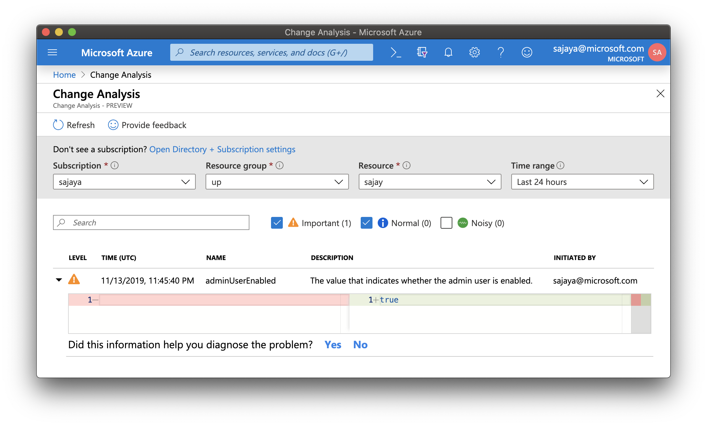

# Change Analysis with ACR 

You can enable change analysis service on your subscription in the [Azure Portal](https://docs.microsoft.com/en-us/azure/azure-monitor/app/change-analysis) or using the following command 

```sh
az provider register  -n 'Microsoft.ChangeAnalysis'
```

Once this has been enabled you can view changes on your registry. 

For e.g. you can see that the `adminUserEnabled` boolean has been changed on the registry. 

