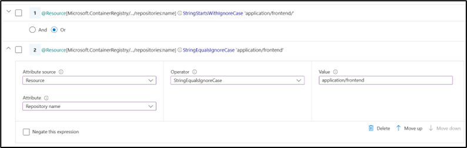

> **[!NOTE]**
> This feature is available as a private preview.

## Private Preview Documentation - ACR ABAC Repository Permissions

Azure attribute-based access control (Azure ABAC) enables you to scope permissions to repositories within a registry when assigning roles. It improves your security footprint by granting permissions to specific repositories instead of the entire registry.

Azure ABAC builds on Azure role-based access control (Azure RBAC) by allowing you to [specify conditions when authoring Azure role assignments](https://learn.microsoft.com/en-us/azure/role-based-access-control/conditions-overview). ABAC conditions can scope role assignment permissions to specific repositories (in a registry) based on repository name conditions. For instance, you can choose to grant role assignment access only to repository names that match a specific prefix or have an exact name match.

ABAC conditions can be used with both [built-in ACR roles](https://learn.microsoft.com/en-us/azure/container-registry/container-registry-roles?tabs=azure-cli) and custom role assignments. It can also be used with all forms of Microsoft Entra ID identities such as users, groups, service principals, and managed identities. All ACR SKUs support this capability.

> **Important**: This feature is in private preview and is not recommended for production workloads.

> **Important**: To create role assignments with ABAC conditions, you must opt into ABAC-enabled repository permissions in your registry properties. By opting in, your registry will only recognize a new lineup of built-in ACR roles and permissions when handling authorization requests for specific registry actions, such as pushing and pulling images. This will allow you to grant repository-level permissions when creating role assignment conditions, which improves registry security. The new built-in ACR roles also enhance the security of your registry by enabling the separation of [control plane and data plane actions](https://learn.microsoft.com/en-us/azure/role-based-access-control/role-definitions#control-and-data-actions).

> **Important**: Please note, once opted in to ABAC permissions mode in registry properties, your registry will stop acknowledging certain existing built-in ACR roles and ACR permissions when handling authorization requests for specific registry actions, even if your registry does not have role assignments with ABAC conditions. This means your existing role assignments and permissions may not work and may need to be revisited.

> **Important**: Additionally, the current preview experience prevents ACR Tasks from functioning properly when a registry is opted in. This ACR Tasks limitation is being addressed as ABAC Repository Permissions heads to public preview. For more information, please see [Transition to ABAC-enabled Repository Permissions](#transition-to-abac-enabled-repository-permissions) and [Private Preview Limitations of ABAC-Enabled Repository Permissions](#private-preview-limitations-of-abac-enabled-repository-permissions).

## Transition to ABAC-enabled Repository Permissions

ABAC-enabled Repository Permissions is currently in private preview. As such, you must first register your subscription for the private preview and contact the ACR team at <acr-pm@microsoft.com> for registration approval. Afterwards, you must individually opt in every registry within your registered subscription for ABAC-enabled repository permissions.

> **Important**: Once a registry is opted into ABAC-enabled repository permissions, certain existing built-in ACR roles and permissions will not be honored by Azure Container Registry. A new set of ABAC-enabled built-in ACR roles and permissions will supersede the existing roles.

> **Important**: Additionally, ACR Tasks will not function properly when a registry is opted in. This ACR Tasks limitation is being addressed as ABAC Repository Permissions heads to public preview. This is detailed under “Granting Repository Level Permissions in Azure Role Assignments”. 

### Checklist for Private Preview - ACR ABAC Repository Permissions

The table below summarizes the steps you need to undertake to participate in the Private Preview. These steps are explained in detail later in this document.

| Step Number | Step Description |
|-------------|------------------|
| 1          | Register subscription for preview. Registering the subscription has no side effects on any Azure resources contained within. |
| 2          | Contact the ACR Team at <acr-pm@microsoft.com> for approval of subscription preview registration. |
| 3          | Install preview CLI extension to enable interacting with ABAC-specific flags in `az acr` CLI. |
| 4          | Opt in individual registries (within a registered subscription) to ABAC Permissions Mode through `az acr` CLI. Note: Both newly created and existing registries can be opted to ABAC Permissions Mode. |
| 5          | For registries opted in to ABAC Permissions Mode, understand that certain existing role assignments (both built-in ACR roles and custom ACR roles) that are involved with ACR permissions for pushing and pulling will stop working. Note: Other registries in the same subscription that are not opted in to ABAC Permissions Mode are unaffected. |
| 6         | To grant repository permissions, assign new ABAC-enabled built-in ACR roles to registries opted in to ABAC Permissions Mode. |

### Subscription Preview Registration

To use this preview with your registry, you must register your subscription for the preview. Registering the subscription has no side effects on any Azure resources contained within.

#### Subscription Preview Registration through `az cli`

To register your subscription for the preview, you can run the following az cli command.

```bash
az feature register \
--namespace Microsoft.ContainerRegistry \
--name AllowAttributeBasedAccessControl
```

### Contact the ACR Team for Subscription Preview Registration Approval

After registering your subscription for the preview, you must contact the ACR team at <acr-pm@microsoft.com> for approval of your subscription preview registration request in the previous step.

### Install Preview CLI Extension

To experience the private preview, installing a preview CLI extension to `az acr` is required.

Installing the preview CLI extension has no other side effects other than allowing certain ABAC-specific CLI flags to appear in `az acr create` and `az acr update`.

```bash
az extension add --source https://acrazextpreview.blob.core.windows.net/cli-extensions/acrabac-1.0.0b1-py3-none-any.whl --allow-preview true
```

## Opt in an Individual Registry to ABAC Permissions Mode

Once your subscription registration for the preview has been approved, you can opt in individual registries within the subscription to ABAC-enabled repository permissions mode. This can be done for both new and existing registries through the `az acr` CLI.

### Opting in when Creating a New Registry

#### Opting in when Creating a New Registry through `az cli`

You can opt new registries to ABAC-enabled repository permissions if the subscription has been registered for the preview. When creating a registry through az acr create, you can specify `--role-assignment-mode` to configure whether the new registry should be enabled for ABAC-enabled Repository Permissions. By default, this option is false, and new registries in your subscription will not be opted into  ABAC-enabled Repository Permissions.

> Important: Once a registry is opted into ABAC-enabled repository permissions, certain existing built-in ACR roles and permissions will not be honored by Azure Container Registry. A new set of ABAC-enabled built-in ACR roles and permissions will supersede the existing roles. For more details on granting repository permissions using the new built-in ACR roles, please see [Granting Repository Level Permissions in Azure Role Assignments](#granting-repository-level-permissions-in-azure-role-assignments).

To create a new registry with ABAC-enabled Repository Permissions, run the following az cli command.

```bash
az acr create -n MyRegistry -g MyResourceGroup --role-assignment-mode AbacRepositoryPermissions
```

### Opting in an Existing Registry

#### Opting in an Existing Registry through `az cli`

You can opt existing registries to ABAC-enabled repository permissions if the subscription has been registered for the preview. You can specify `--role-assignment-mode` when running az acr update to configure whether an existing registry should be enabled for ABAC-enabled Repository Permissions.

> Important: Once a registry is opted into ABAC-enabled repository permissions, certain existing built-in ACR roles and permissions will not be honored by Azure Container Registry. A new set of ABAC-enabled built-in ACR roles and permissions will supersede the existing roles. For more details on granting repository permissions using the new built-in ACR roles, please see [Granting Repository Level Permissions in Azure Role Assignments](#granting-repository-level-permissions-in-azure-role-assignments).

To configure an existing registry for ABAC-enabled Repository Permissions, run the following az cli command.

```bash
az acr update -n MyRegistry -g MyResourceGroup --role-assignment-mode AbacRepositoryPermissions
```

After an existing registry has been opted into ABAC-enabled Repository Permissions, you should refresh your local credentials to the registry by logging out.

```bash
docker logout
az acr login -n MyRegistry
```

### Checking if an Existing Registry is Opted into ABAC Permissions Mode

To check if an existing registry is opted into ABAC Permissions Mode, run the following az cli command.

```bash
az acr show -n MyRegistry --query roleAssignmentMode
```

If the `roleAssignmentMode` is set to `AbacRepositoryPermissions`, your registry is opted into ABAC-enabled Repository Permissions.

If the `roleAssignmentMode` is set to `LegacyRegistryPermissions`, your registry is not opted into ABAC-enabled Repository Permissions.

## Granting Repository-Level Permissions in Azure Role Assignments

Once a registry is opted into ABAC-enabled repository permissions, certain existing built-in ACR roles will not be honored by Azure Container Registry. A new set of ABAC-enabled built-in ACR roles will supersede the existing roles. These new built-in ACR roles are more secure for your registry as they separate the permissions for control plane and data plane actions. The new set of built-in ACR roles can be optionally scoped to grant permissions to specific repositories in a registry.

### Behavior of Built-in ACR Roles for ABAC-enabled Registries

For ABAC-enabled registries, the following table shows the actions a built-in ACR role can perform on an ABAC-enabled registry.

> **Important**: Take note that 3 existing built-in ACR roles (specifically AcrPush, AcrPull, and AcrDelete) will no longer have any permissions at all on an ABAC-enabled registry. For ABAC-enabled registries, please do not use these 3 existing built-in ACR roles.
>
> > **Important**: These 3 existing built-in ACR roles will continue to have permissions on non-ABAC-enabled registries.
>
> > **Note**: The existing built-in ACR role AcrImageSigner will continue to have permissions to sign images across all repositories for ABAC-enabled registries.

> **Important**: Additionally, existing built-in Entra roles (specifically Owner, Contributor, and Reader roles) will only have control plane permissions. These built-in roles (specifically Owner, Contributor, and Reader) will no long have registry data plane access such as the ability to push or pull images to/from repositories. Only new the ABAC-enabled built-in ACR roles listed below will have registry data plane access, such as pushing and pulling images to/from repositories.

> **Important**: For non-ABAC-enabled registries, the new ABAC-enabled roles below do not have any effect. Please continue using the existing built-in roles for non-ABAC-enabled registries. For reference, the **the current behavior of existing built-in ACR roles for non-ABAC-enabled registries** is detailed at [the public documentation for Azure Container Registry roles and permissions](https://learn.microsoft.com/en-us/azure/container-registry/container-registry-roles?tabs=azure-cli).

> **Important**: Important: If you assign an ABAC-enabled role (such as the ACR Repository Reader role) without any ABAC conditions to restrict to specific repositories, the role assignment will grant permissions to the entire registry.

| Role | Notes | [Access Resource Manager](https://learn.microsoft.com/en-us/azure/container-registry/container-registry-roles?tabs=azure-cli#access-resource-manager) | [Create/delete registry](https://learn.microsoft.com/en-us/azure/container-registry/container-registry-roles?tabs=azure-cli#create-and-delete-registry) | [Push artifacts](https://learn.microsoft.com/en-us/azure/container-registry/container-registry-roles?tabs=azure-cli#push-image) | [Pull artifacts](https://learn.microsoft.com/en-us/azure/container-registry/container-registry-roles?tabs=azure-cli#pull-image) | List all repositories in the registry | List artifacts, manifests, and tags within repositories | [Delete images, artifacts, and tags within repositories](https://learn.microsoft.com/en-us/azure/container-registry/container-registry-roles?tabs=azure-cli#delete-image-data) | [Change policies](https://learn.microsoft.com/en-us/azure/container-registry/container-registry-roles?tabs=azure-cli#change-policies) | [Sign images](https://learn.microsoft.com/en-us/azure/container-registry/container-registry-roles?tabs=azure-cli#sign-images) | Scope assigned permissions to specific repositories during role assignment |
| --- | --- | --- | --- | --- | --- | --- | --- | --- | --- | --- | --- |
| Owner | Existing Role. Only has control plane permissions. No data plane permissions to registry. | Yes | Yes | | | | | | Yes | | |
| Contributor | Existing Role. Only has control plane permissions. No data plane permissions to registry. | Yes | Yes | | | | | | Yes | | |
| Reader | Existing Role. Only has control plane permissions. No data plane permissions to registry. | Yes | | | | | | | | | |
| AcrPush | Existing Role. No permissions granted for ABAC-enabled registries. | | | | | | | | | | |
| AcrPull | Existing Role. No permissions granted for ABAC-enabled registries. | | | | | | | | | | |
| AcrDelete | Existing Role. No permissions granted for ABAC-enabled registries. | | | | | | | | | | |
| AcrImageSigner | Existing Role. The existing AcrImageSigner role will continue to have permissions to sign images across all repositories for ABAC-enabled registries.  | | | | | | | | | | |
| ACR Repository Reader | New ABAC-enabled Role. Will have data plane permissions for ABAC-enabled registries. | | | | Yes | | Yes | | | | Yes |
| ACR Repository Writer | New ABAC-enabled Role. Will have data plane permissions for ABAC-enabled registries. | | | Yes | Yes | | Yes | | | | Yes |
| ACR Repository Contributor | New ABAC-enabled Role. Will have data plane permissions for ABAC-enabled registries. | | | Yes | Yes | | Yes | Yes | | | Yes |
| ACR Registry Catalog Lister | New ABAC-enabled Role. Note that this role grants permissions to list all repositories that exist in the registry, even if the role assignee does not have push or pull permissions to certain repositories. | | | | | Yes | | | | | The Catalog Lister role to list repositories cannot be scoped to specific repositories in a registry. Note that this role grants permissions to list all repositories that exist in the registry, even if the role assignee does not have push or pull permissions to certain repositories. |

### Overview of ABAC-Enabled Built-in Roles

#### ABAC-enabled ACR Repository Reader Role


The new “ACR Repository Reader” role grants permissions to pull and list artifacts stored in a registry’s repositories. It also grants permission to list manifests and tags stored within repositories.

This role also does not grant permission to query the list of repositories because the role can be optionally scoped to specific repositories with ABAC conditions.

To scope role permissions to specific repositories with ABAC conditions, please see [Scoping Role Assignments to Specific Repositories](#scoping-role-assignments-to-specific-repositories).

> **Important**: If you assign this role without any ABAC conditions to restrict the role assignment grant to specific repositories, the role assignment will grant permissions to the entire registry.

#### ABAC-enabled ACR Repository Writer Role

The new “ACR Repository Writer” role grants permissions to push artifacts to a registry’s repositories in addition to pulling and listing artifacts. It also grants permission to list manifests and tags stored within repositories.

This role also does not grant permission to query the list of repositories because the role can be optionally scoped to specific repositories with ABAC conditions.

To scope role permissions to specific repositories with ABAC conditions, please see [Scoping Role Assignments to Specific Repositories](#scoping-role-assignments-to-specific-repositories).

> **Important**: If you assign this role without any ABAC conditions to restrict the role assignment grant to specific repositories, the role assignment will grant permissions to the entire registry.

#### ABAC-enabled ACR Repository Contributor Role

The new “ACR Repository Contributor” role grants permissions to delete artifacts stored in a registry’s repositories in addition to pushing, pulling, and listing artifacts. It also grants permission to list manifests and tags stored within repositories.

This role also does not grant permission to query the list of repositories because the role can be optionally scoped to specific repositories with ABAC conditions.

To scope role permissions to specific repositories with ABAC conditions, please see [Scoping Role Assignments to Specific Repositories](#scoping-role-assignments-to-specific-repositories).

> **Important**: If you assign this role without any ABAC conditions to restrict the role assignment grant to specific repositories, the role assignment will grant permissions to the entire registry.

#### ACR Registry Catalog Lister Role

The new "ACR Registry Catalog Lister" role grants permissions to query and list all repositories in the registry. Take note that this role does not grant the ability to push, pull, or list any artifacts contained within repositories.

This role is useful because the new ABAC-enabled repository roles do not grant permission to query and list repositories in the registry.

> **Important**: The Catalog Lister role to list repositories cannot be scoped to specific repositories in a registry. This role grants permissions to list all repositories that exist in the registry, even if the role assignee does not have push or pull permissions to certain repositories.

### Scoping Role Assignments to Specific Repositories

Permissions of ABAC-enabled roles can be optionally scoped to specific repositories during role assignment. You can scope ABAC-enabled role assignments through the Azure Portal or `az cli`.

> Important: If you assign an ABAC-enabled role (such as the ACR Repository Reader role) without any ABAC conditions to restrict to specific repositories, the role assignment will grant permissions to the entire registry.

#### Scoping Role Assignments to Specific Repositories through Azure Portal

Scoping role assignments can be done through the Access control (IAM) blade in the Azure Container Registry portal or through `az cli`. The Azure Container Registry team recommends using the portal experience in lieu of the `az role assignment` command for scoping role assignments during the private preview for ease of use.

This section describes the Portal steps to granting permissions to enable pulling and listing artifacts within specific repositories. The following example assigns an ACR Repository Reader role that is scoped to repositories with names that match either a specific prefix or has an exact name match.

1. Proceed to the Access control (IAM) pane.


2. Proceed with adding a role assignment through the dropdown.


3. Select the ACR Repository Reader role, which is an ABAC-enabled role.


4. Proceed with the role assignment workflow by selecting the members and identities you want to assign the role to.


5. Proceed to the conditions pane to scope the role assignment to specific repositories by attaching ABAC conditions for repository names to this role assignment.


6. Proceed to add a condition by clicking the "Add condition" button. Adding a condition (an ABAC condition) allows you to author role assignment conditions to scope the role assignment to specific repositories.


7. Before adding a role assignment condition, you must first select the actions that you want to grant if the condition is true. For example, the selected actions will grant permission to pull and list artifacts within repositories. You can use this interface to restrict and grant only specific actions, such as granting permission to list tags and artifacts in a repository but not pull.


8. Afterwards, you must build a conditional expression to finally create the condition that will scope the role assignment. The next section will detail a walkthrough on crafting a conditional expression.


#### Building an ABAC Conditional Expression through Azure Portal

You must build a conditional expression that will grant the actions if the expression evaluates to true. This section walks through recommended ABAC Conditional Expressions for common repository permission scenarios.

##### Scenario: Granting Permissions to a Repository Namespace Using Wildcard Conditions

Suppose your scenario requires you to:

1. grant read and pull permissions to all child repositories under the `application/frontend/` namespace, such as `application/frontend/platform` and `application/frontend/code`.
2. grant read and pull permissions to the repository `application/frontend` itself.

For this scenario, the ABAC conditional expression must contain 2 rules to satisfy the scenario requirements:

1. An ABAC condition to grant permissions to all child repositories under `application/frontend`
2. Another ABAC condition to grant permissions to the repository `application/frontend` itself.

You can use the expression builder interface to add multiple ABAC rules to your role assignment.


**Step 1**: First, add the following ABAC condition to grant permissions to all child repositories under `application/frontend/`.


> **Important**: You must include the trailing slash when authoring ABAC conditions for repository prefix matches, such as the trailing `"/"` character in the `application/frontend/` example above.
>
> Otherwise, if you author a prefix condition without the trailing `"/"` such as `application/frontend`, the prefix condition will match broadly and grant overly broad permissions to other repositories that match the specified prefix.
>
> For example, the condition `application/frontend` will match repositories such as `application/frontendv1` and `application/frontend-code/backup`, which are not intended to be matched.

> **Important**: ABAC conditions are case sensitive. It is recommended that you use “StringStartsWithIgnoreCase” and all-lowercase characters when authoring prefix match rules like in the screenshot above.

**Step 2**: Afterwards, add an additional ABAC condition with the `Or` operator. The second ABAC condition will grant permission to pull the repository `application/frontend` itself.



> **Important**: You must select the `Or` evaluation rule for this scenario so that role assignment permissions are granted when accessing either the child repositories under `application/frontend/...` **or** the repository `application/frontend` itself.

##### Scenario: Granting Permissions to a Specific Repository with an Exact Match Rule

Suppose your scenario requires you to:

1. grant read and pull permissions only to the repository `application/backend/redis` itself.

For this scenario, the ABAC conditional expression must contain 1 rule to satisfy the scenario requirements:

1. An ABAC condition to grant permissions only to the repository `application/backend/redis` itself.

**Step 1**: The only step is to add the following ABAC condition to grant permissions to the repository `application/backend/redis`.


##### Scenario: Multiple ABAC Conditions

Multiple ABAC Conditions for repository can be specified when granting role assignments. ABAC supports conditional expressions with multiple conditions through `And` and `Or` operators.


##### Scenario: Grouping and Ordering Multiple ABAC Conditions

The precedence of evaluating conditional expressions can also be specified through changing the order in which ABAC conditions are evaluated. Additionally, multiple ABAC Conditions can be grouped to control the evaluation order with granularity.

You can use the ABAC condition interface to group and order multiple conditions to fine-tune the evaluation of your conditional expressions.


##### Scenario: Restricting Permissions from Specific Repositories with a Negation Rule

ABAC also supports negating conditions within expressions to grant permissions to repositories aside from the one you specifically negate.

For example, suppose you want to grant read permissions to all repositories except the specific repository named `application/secret`.

You can create the following ABAC rule with a negation rule to exclude the repository `application/secret` when granting read permissions. In effect, the user will be able to access other repositories except `application/secret`.


## Private Preview Limitations of ABAC-Enabled Repository Permissions

### Limitation: ACR Tasks Permissions Limitation for ABAC-Enabled Registries

When a registry is opted into ABAC-enabled Repository Permissions, both new and existing ACR Tasks created within the ABAC-enabled registry will not be able to push or pull images from the registry. This is being addressed as the preview progresses. To see if your registry has been opted into ABAC-enabled Repository Permissions, run the following az cli command.

```bash
az acr show -n MyRegistry --query roleAssignmentMode
```

If the roleAssignmentMode is set to `AbacRepositoryPermissions`, your registry is opted into ABAC-enabled Repository Permissions and thus ACR Tasks may have permission issues to the registry itself.

If the `roleAssignmentMode` is set to `LegacyRegistryPermissions`, your registry is not opted into ABAC-enabled Repository Permissions and thus ACR Tasks is unaffected.
