# Access-Based Access Control for Azure Container Registry Repository Permissions (Private Preview)

> [!IMPORTANT]
> The Azure Container Registry (ACR) Access-Based Access Control (ABAC) Repository Permissions feature is currently in private preview. As a private preview feature, we encourage users to explore its capabilities in a non-production environment, and avoid production workloads.

Azure attribute-based access control (Azure ABAC) enables you to scope permissions within your registry by scoping roles to specific repositories. This approach enhances your security by allowing permissions for particular repositories, rather than the entire registry. This approach strengthens the security posture of your container registry by limiting access, thereby reducing the risk of unauthorized access or data breaches.

Azure ABAC builds on Azure Entra role-based access control (Azure RBAC) introducing the ability to set conditions when authoring [Azure Entra role assignments](https://learn.microsoft.com/en-us/azure/role-based-access-control/conditions-overview). ABAC conditions can narrow down role assignment permissions to specific repositories within the registry based on set conditions. For example, you might grant access solely to repositories that start with a certain prefix or exactly match a given name, providing a more secure and controlled access management system.

ABAC conditions can enhance security by allowing integration with both [built-in ACR roles](https://learn.microsoft.com/en-us/azure/container-registry/container-registry-roles) and custom role assignments. They are also compatible with various Microsoft Entra ID identities, including users, groups, service principals, and managed identities. This capability is supported across all ACR SKUs, ensuring a wide range of options for access management within your registry.

> [!IMPORTANT]
> To create role assignments with ABAC conditions, you must first switch to ABAC-enabled repository permissions mode in your registry settings. By opting into this permissions mode, your registry transitions to a new set of built-in ACR roles and permissions, which are recognized during authorization requests for registry actions like image push and pull. This shift allows for the assignment of repository-level permissions through role assignment conditions, bolstering registry security. Moreover, the updated built-in ACR roles further secure your registry by facilitating the distinction between [control plane and data plane actions](https://learn.microsoft.com/en-us/azure/role-based-access-control/role-definitions#control-and-data-actions), ensuring a more robust and secure management of your container registry.

> [!IMPORTANT]
> Please note that once you opt into ABAC permissions mode in your registry properties, the registry will no longer recognize certain existing built-in ACR roles and permissions for authorization requests. This change affects specific registry actions, and even if you do not have role assignments with ABAC conditions, the shift will occur. Consequently, your current role assignments and permissions might become ineffective and may require updates to align with the new ABAC permissions mode. A new set of ABAC-enabled built-in ACR roles and permissions will supersede the existing roles for pushing, pulling, and deleting images, as well as for listing repositories.

> [!IMPORTANT]
> During the current preview phase, opting a registry into ABAC may impact the functionality of ACR Tasks. This limitation is known and is being actively addressed as we progress towards the public preview of ABAC Repository Permissions. For more information, please see [Private Preview Limitations of ABAC-Enabled Repository Permissions](#private-preview-limitations-of-abac-enabled-repository-permissions).

## Prerequisites

* You can use the [Azure Cloud Shell](https://learn.microsoft.com/en-us/azure/cloud-shell/overview) or a local installation of the Azure CLI to run the command examples in this article. If you'd like to use it locally, version 2.54.0 or later is required. Run `az --version` for finding the version. If you need to install or upgrade, see [Install Azure CLI][https://learn.microsoft.com/en-us/cli/azure/install-azure-cli].
* Sign in to the Azure preview portal at [https://portal.azure.com/***?feature.abacACR=true***](https://portal.azure.com/?feature.abacACR=true) for the ACR ABAC Private Preview.

## Transition to ABAC-enabled repository permissions

### Checklist for private preview - ACR ABAC repository permissions

The table below summarizes the steps you need to undertake to participate in the Private Preview. These steps are explained in detail later in this document.

| Step Number | Step Description |
|-------------|------------------|
| 1           | Register your subscription for the preview. This registration does not affect any Azure resources within the subscription. |
| 2           | Contact the ACR Team at <acr-pm@microsoft.com> for approval of subscription preview registration.  |
| 3           | Install the preview CLI extension to enable ABAC-specific flags in the `az acr` CLI commands. |
| 4           | Individually opt in registries to ABAC Permissions Mode using the `az acr` CLI. You can individually opt in both new and existing registries within a registered subscription. |
| 5           | Be aware that for registries opted into ABAC Permissions Mode, certain existing role assignments will cease to function. This includes both built-in ACR roles and custom ACR roles related to image push, pull, and delete permissions, as well as repository list permissions. Other registries not opted into ABAC Permissions Mode will remain unaffected. |
| 6           | Assign new ABAC-enabled built-in ACR roles to grant permissions to registries that have opted into ABAC Permissions Mode. |

### Subscription preview registration

To enable the Azure Container Registry (ACR) Access-Based Access Control (ABAC) Repository Permissions feature in private preview for your registry, follow these steps:

1. **Submit Subscription Preview Registration Request:** Begin by submitting a request to register your subscription for the preview. Use the Azure CLI command below to submit a preview registration request:

    ```bash
    az feature register \
    --namespace Microsoft.ContainerRegistry \
    --name AllowAttributeBasedAccessControl
    ```

2. **Contact the ACR Team:** After registering, you need to get registration approval from the ACR team <acr-pm@microsoft.com>. Reach out to them with the details of your subscription preview registration request.

3. **Propagate Preview Registration:** Once the feature 'AllowAttributeBasedAccessControl' is registered and approved, invoking `az provider register -n Microsoft.ContainerRegistry` is required to get the change propagated to the subscription.

    ```bash
    az provider register -n Microsoft.ContainerRegistry
    ```

### Install Preview CLI extension

To experience the private preview, you need to install a preview CLI extension to `az acr`. This extension enables ABAC-specific CLI flags in `az acr create` and `az acr update`.

1. Run the `az extension add` command to install the preview CLI extension.

    ```bash
    az extension add \
    --source https://acrazextpreview.blob.core.windows.net/cli-extensions/acrabac-1.0.0b1-py3-none-any.whl \
    --allow-preview true
    ```

## Opt in an individual registry to ABAC Repository Permissions Mode

Once your subscription registration for the preview has been approved and you've installed the preview CLI extension, you can individually opt in registries within the subscription to ABAC-enabled repository permissions mode. This can be done for both new and existing registries through the `az acr` CLI.

### Opt in new registry - Azure CLI

You have the option to opt new registries to ABAC-enabled repository permissions if the subscription has been registered for the preview.

1. Create a registry through `az acr create` and specify `--role-assignment-mode` to configure whether the new registry should be enabled for ABAC-enabled Repository Permissions.

2. By default, if this option is false, new registries in your subscription will not be opted into ABAC-enabled repository permissions mode.

3. All SKU types support ABAC-enabled repository permissions mode.

    ```bash
    az acr create -n MyRegistry -g MyResourceGroup --sku Basic --role-assignment-mode AbacRepositoryPermissions
    ```

### Opt in existing registry - Azure CLI

You have the option to opt existing registries to ABAC-enabled repository permissions if the subscription has been registered for the preview.

1. Run `az acr update` and specify `--role-assignment-mode` to configure whether an existing registry should be enabled for ABAC-enabled Repository Permissions.

    ```bash
    az acr update -n MyRegistry -g MyResourceGroup --role-assignment-mode AbacRepositoryPermissions
    ```

2. After an existing registry has been opted into ABAC-enabled repository permissions mode, you should refresh your local credentials to the registry.

    ```bash
    az acr login -n MyRegistry
    ```

### Verify permissions mode of an existing registry

1. Run `az acr show` to check if an existing registry is opted into ABAC Permissions Mode.

    ```bash
    az acr show -n MyRegistry --query roleAssignmentMode
    ```

2. If the `roleAssignmentMode` is set to `AbacRepositoryPermissions`, your registry is opted into ABAC-enabled Repository Permissions Mode.

3. If the `roleAssignmentMode` is set to `LegacyRegistryPermissions`, your registry is not opted into ABAC-enabled Repository Permissions Mode.

## Managing repository-level permissions in Azure Entra role assignments

> [!IMPORTANT]
> Please note that once you opt into ABAC permissions mode in your registry properties, the registry will no longer recognize certain existing built-in ACR roles and permissions for authorization requests. This change affects specific registry actions, and even if you do not have role assignments with ABAC conditions, the shift will occur. Consequently, your current role assignments and permissions might become ineffective and may require updates to align with the new ABAC permissions mode. A new set of ABAC-enabled built-in ACR roles and permissions will supersede the existing roles.

### Behavior of Built-in ACR Roles for ABAC-enabled Registries

Here is a summary of the behavior of built-in ACR roles for ABAC-enabled registries:

* The three existing built-in ACR roles ***AcrPush***, ***AcrPull***, and ***AcrDelete*** will no longer have any permissions at all on an ABAC-enabled registry. For ABAC-enabled registries, please do not use these three existing built-in ACR roles.

* The existing built-in ACR role ***AcrImageSigner*** will continue to have permissions to sign images across all repositories for ABAC-enabled registries.

* The existing built-in Entra roles ***Owner***, ***Contributor***, and ***Reader*** will only have control plane permissions, such as the ability to view registry properties or manage registry settings.

* The existing built-in Entra roles ***Owner***, ***Contributor***, and ***Reader***  will no longer have registry data plane access, such as the ability to view/list repositories or push/pull images to/from repositories.

* Only new ABAC-enabled built-in ACR roles will have registry data plane access, such as pushing and pulling images to/from repositories. For ABAC-enabled registries, the new roles should be used whether you are assigning permissions to specific repositories or all repositories.

* If you assign an ABAC-enabled role such as the ***Azure Container Registry Repository Reader*** role without any ABAC conditions to restrict to specific repositories, the role assignment will grant permissions to all repositories.

| Role | Notes | [Access Resource Manager](https://learn.microsoft.com/en-us/azure/container-registry/container-registry-roles?tabs=azure-cli#access-resource-manager) | [Create/delete registry](https://learn.microsoft.com/en-us/azure/container-registry/container-registry-roles?tabs=azure-cli#create-and-delete-registry) | [Push artifacts](https://learn.microsoft.com/en-us/azure/container-registry/container-registry-roles?tabs=azure-cli#push-image) | [Pull artifacts](https://learn.microsoft.com/en-us/azure/container-registry/container-registry-roles?tabs=azure-cli#pull-image) | List all repositories in the registry | List artifacts, manifests, and tags within repositories | [Delete images, artifacts, and tags within repositories](https://learn.microsoft.com/en-us/azure/container-registry/container-registry-roles?tabs=azure-cli#delete-image-data) | [Change policies](https://learn.microsoft.com/en-us/azure/container-registry/container-registry-roles?tabs=azure-cli#change-policies) | [Sign images](https://learn.microsoft.com/en-us/azure/container-registry/container-registry-roles?tabs=azure-cli#sign-images) | Scope assigned permissions to specific repositories during role assignment |
| --- | --- | --- | --- | --- | --- | --- | --- | --- | --- | --- | --- |
| Owner | Existing Role. Only has control plane permissions. No data plane permissions to registry. | X | X | | | | | | X | | |
| Contributor | Existing Role. Only has control plane permissions. No data plane permissions to registry. | X | X | | | | | | X | | |
| Reader | Existing Role. Only has control plane permissions. No data plane permissions to registry. | X | | | | | | | | | |
| AcrPush | Existing Role. No permissions granted for ABAC-enabled registries. | | | | | | | | | | |
| AcrPull | Existing Role. No permissions granted for ABAC-enabled registries. | | | | | | | | | | |
| AcrDelete | Existing Role. No permissions granted for ABAC-enabled registries. | | | | | | | | | | |
| AcrImageSigner | Existing Role. The existing AcrImageSigner role will continue to have permissions to sign images across all repositories for ABAC-enabled registries.  | | | | | | | | | X | |
| Azure Container Registry Repository Reader | New ABAC-enabled Role. Will have data plane permissions for ABAC-enabled registries. | | | | X | | X | | | | X |
| Azure Container Registry Repository Writer | New ABAC-enabled Role. Will have data plane permissions for ABAC-enabled registries. | | | X | X | | X | | | | X |
| Azure Container Registry Repository Contributor | New ABAC-enabled Role. Will have data plane permissions for ABAC-enabled registries. | | | X | X | | X | X | | | X |
| Azure Container Registry Catalog Lister | New ABAC-enabled Role. Note that this role grants permissions to list all repositories that exist in the registry, even if the role assignee does not have push or pull permissions to certain repositories. | | | | | X | | | | | The Catalog Lister role to list repositories cannot be scoped to specific repositories in a registry. Note that this role grants permissions to list all repositories that exist in the registry, even if the role assignee does not have push or pull permissions to certain repositories. |

### Behavior of Existing Built-in ACR Roles for Non-ABAC-enabled registries

Here is a summary of the behavior of ***existing built-in ACR roles*** for ***non-ABAC-enabled*** registries:

* For non-ABAC-enabled registries, the new ABAC-enabled roles do not have any effect.

* Please continue using the existing built-in roles for non-ABAC-enabled registries.

* For reference, see [ACR roles and permissions](https://learn.microsoft.com/en-us/azure/container-registry/container-registry-roles) for the current behavior of existing built-in ACR roles for non-ABAC-enabled registries.

### Description of new ABAC-enabled built-in roles

**ABAC-enabled Azure Container Registry Repository Reader Role**: The new ***Azure Container Registry Repository Reader*** role grants permissions to pull and list artifacts stored in a registry's repositories. It also grants permission to list manifests and tags stored within repositories. Note that this role does not grant permission to query the list of repositories because the role can be optionally scoped to specific repositories with ABAC conditions.

**ABAC-enabled Azure Container Registry Repository Writer Role**: The new ***Azure Container Registry Repository Writer*** role grants permissions to push artifacts to a registry’s repositories in addition to pulling and listing artifacts. It also grants permission to list manifests and tags stored within repositories. Note that this role does not grant permission to query the list of repositories because the role can be optionally scoped to specific repositories with ABAC conditions.

**ABAC-enabled Azure Container Registry Repository Contributor Role**: The new ***Azure Container Registry Repository Contributor*** role grants permissions to delete artifacts and tags stored in a registry's repositories in addition to pushing, pulling, and listing artifacts. It also grants permission to list manifests and tags stored within repositories. Note that this role does not grant permission to query the list of repositories because the role can be optionally scoped to specific repositories with ABAC conditions.

**Azure Container Registry Catalog Lister Role** The new ***Azure Container Registry Catalog Lister*** role grants permissions to view, query, and list all repositories in the registry. Take note that this role does not grant the ability to push, pull, or list any artifacts contained within repositories. This role is useful because the new ABAC-enabled repository roles do not grant permission to query and list repositories in the registry.

> [!NOTE]
> If you assign ***Azure Container Registry Repository Reader***, ***Azure Container Registry Repository Writer***, or ***Azure Container Registry Repository Contributor*** roles without any ABAC conditions to restrict the role assignment grant to specific repositories, the role assignment will grant permissions to all repositories that exist in the registry.
> The **Azure Container Registry Catalog Lister** role to list repositories cannot be scoped to specific repositories in a registry. Note that this role grants permissions to list all repositories that exist in the registry, even if the role assignee does not have permissions to certain repositories.

Please see [Scoping role assignments to specific repositories in an ABAC-enabled registry](#scoping-role-assignments-to-specific-repositories-in-an-abac-enabled-registry) for more information on how to scope role permissions using ABAC conditions.

## Granting repository-level permissions to all repositories in an ABAC-enabled registry

To grant permissions to all repositories in a registry, you can assign the ABAC-enabled roles like the ***Azure Container Registry Repository Reader***, ***Azure Container Registry Repository Writer***, or ***Azure Container Registry Repository Contributor*** roles without any ABAC conditions. This will grant permissions to all repositories in the registry.

1. Sign in to the Azure preview portal at [https://portal.azure.com/***?feature.abacACR=true***](https://portal.azure.com/?feature.abacACR=true) for the ACR ABAC Private Preview.

2. Locate and select the ***Azure Container Registry***.

3. Choose the registry you wish to manage and navigate to the **Access control (IAM) blade**.

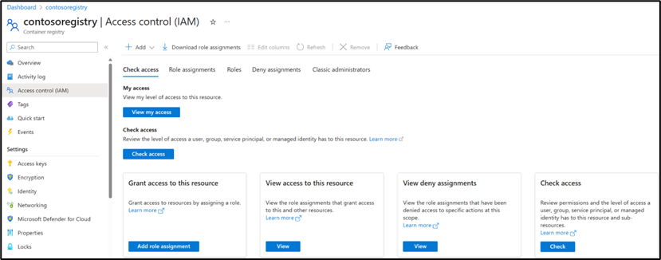

4. Initiate a new role assignment by clicking on **+ Add role assignment**.

5. Proceed with adding a role assignment through the dropdown.

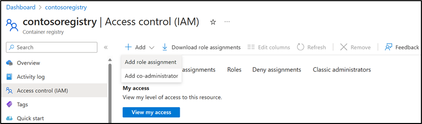

6. Select the **Azure Container Registry Repository Reader role**, from the available ABAC-enabled role options.

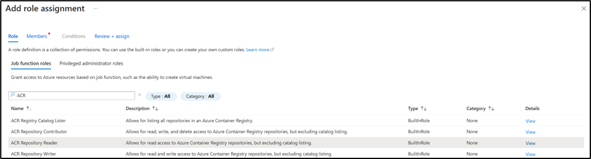

7. Assign access to the role by selecting the members and identities you want to assign the role to.

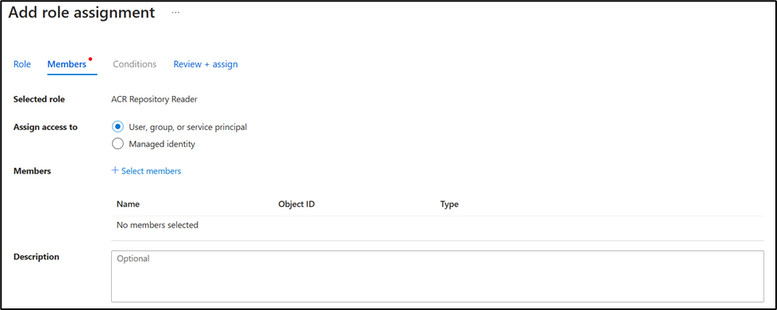

8. Proceed to assign the role without any ABAC conditions to grant permissions to all repositories in the ABAC-enabled registry.

## Scoping role assignments to specific repositories in an ABAC-enabled registry

Permissions of ABAC-enabled roles can be optionally scoped to specific repositories during role assignment. You can scope ABAC-enabled role assignments through the Azure Portal or Azure CLI. During the Private Preview, it is recommended to use the Azure Portal experience for scoping role assignments.

> [!WARNING]
> Assigning an ABAC-enabled role like the Azure Container Registry Repository Reader role without specific ABAC conditions results in granting permissions to all repositories in the registry. If your intent is to scope permissions to particular repositories, it's recommended to specify conditions that restrict access to particular repositories.

### Scoping role assignments to specific repositories - Azure Portal

Scoping role assignments in Azure Container Registry can be done through the Access control (IAM) blade in the Azure Portal or using the Azure CLI (`az cli`). However, during the private preview, the Azure Container Registry team recommends using the portal experience for scoping role assignments, as it is easier to use compared to the az role assignment command.

To enable pulling and listing artifacts within certain repositories, you can assign the ***Azure Container Registry Repository Reader*** role with scoped permissions. The following steps detail how to scope role assignments to specific repositories through the Azure Portal. The following example assigns an Azure Container Registry Repository Reader role that is scoped to repositories that start with a specific prefix or has an exact name match.

1. Sign in to the Azure preview portal at [https://portal.azure.com/***?feature.abacACR=true***](https://portal.azure.com/?feature.abacACR=true) for the ACR ABAC Private Preview.

2. Locate and select the ***Azure Container Registry***.

3. Choose the registry you wish to manage and navigate to the **Access control (IAM) blade**.


4. Initiate a new role assignment by clicking on **+ Add role assignment**.

5. Proceed with adding a role assignment through the dropdown.


6. Select the **Azure Container Registry Repository Reader role**, from the available ABAC-enabled role options.


7. Assign access to the role by selecting the members and identities you want to assign the role to.


8. Move to the **Conditions pane** to define the scope of the role assignment. You can attach ABAC conditions for repository names to this role assignment.

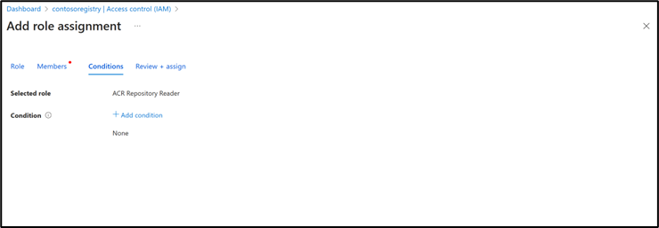

9. Use the **+ Add condition** to add a condition (an ABAC condition) allows you to author role assignment conditions to scope the role assignment to specific repositories.

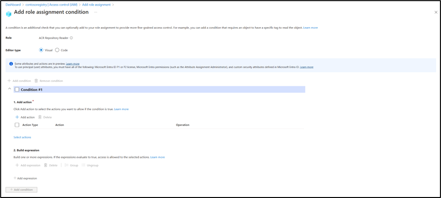

10. When adding a role assignment condition, you must first select the actions you want to grant if the condition is met. For instance, selecting actions will allow permissions to pull and list artifacts within repositories. This interface enables you to restrict and grant only specific actions. For example, you can grant permission to list tags and artifacts in a repository but not to pull them. This ensures that permissions are tailored to the specific needs and roles of users, enhancing security and operational efficiency.

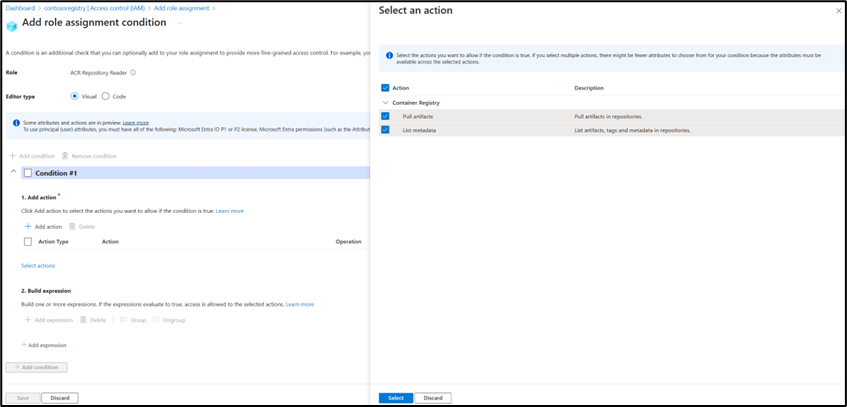

11. Afterwards, you must build a conditional expression to finally create the condition that will scope the role assignment to specific repositories. The [next section](#building-an-abac-conditional-expression---azure-portal) will detail a walkthrough on crafting a conditional expression.

12. Review the conditions to ensure they align with the desired access limitations.

13. Confirm the role assignment to enforce the scoped permissions.

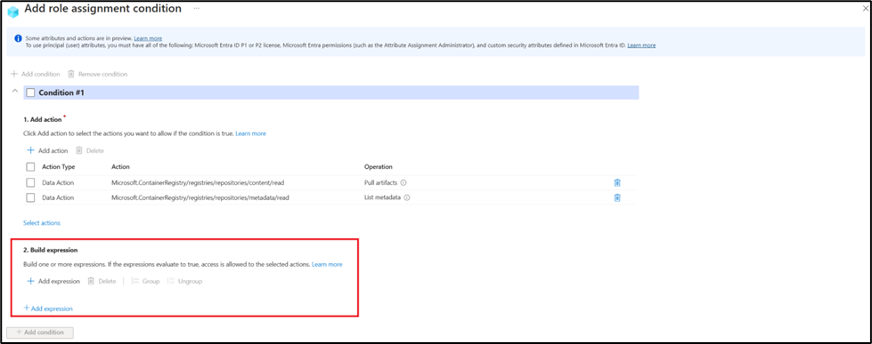

### Building an ABAC Conditional Expression - Azure Portal

Attribute-Based Access Control (ABAC) access control to determine whether access should be granted to specific resources based on attributes. So, using a conditional expression, you can define the conditions under which access should be granted. The conditional expression is a logical statement that evaluates to either true or false. If the expression evaluates to true, the specified actions (such as read, write, or delete operations on a repository) are granted. This approach allows for more granular and flexible access control compared to traditional role-based access control (RBAC).

The section promises to guide the reader through recommended ABAC conditional expressions tailored for common repository permission scenarios.

#### Scenario: Granting permissions with wildcard conditions

This section applies for the scenario where you need to:

1. Grant read and pull permissions to all child repositories under the `application/frontend/` namespace, such as `application/frontend/platform` and `application/frontend/code`.

2. Grant read and pull permissions to the repository `application/frontend` itself.

You would need to create two ABAC conditions:

1. A condition to specify that permissions are granted to any child repositories under the `application/frontend/` namespace.

2. A condition to explicitly grant permissions to the repository named `application/frontend`.

Add the following ABAC condition to grant permissions to all child repositories under `application/frontend/`. You can use the expression builder interface to add multiple ABAC rules to your role assignment.

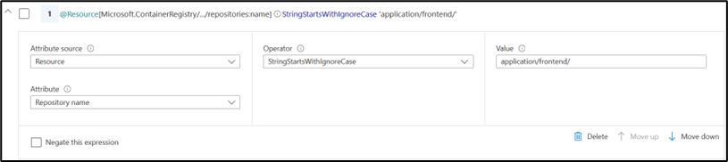

> [!IMPORTANT]
> You must include the trailing slash when creating ABAC conditions for repository prefix matches. For instance, you must add the trailing `"/"` character in `application/frontend/` to ensure the condition is scoped correctly. Without the trailing slash, such as in `application/frontend`, the condition would match too broadly, granting permissions to unintended repositories like `application/frontendv1` and `application/frontend-code/backup`. Remember, ABAC conditions are case-sensitive, so it's advisable to use "StringStartsWithIgnoreCase" and lowercase characters when setting prefix match rules to avoid case-related mismatches.

Next, you must add an additional ABAC condition using the `Or` operator. This second condition will specifically grant permission to pull the `application/frontend` repository itself.

> [!IMPORTANT]
> It's crucial to select the `Or` evaluation rule in this scenario. This ensures that role assignment permissions are correctly granted when accessing either the child repositories under `application/frontend/...` **or** the repository `application/frontend` itself.


By setting up these two conditions, you ensure that both the parent repository and its children have the necessary read and pull permissions.

#### Scenario: Granting permissions with an exact match rules

This section applies for the scenario where you need to:

1. Grant read and pull permissions only to the repository `application/backend/redis` itself.

To meet the scenario requirements, you would need to create an ABAC conditional expression with one rule that grants permissions to the specific repository.

1. Add the following ABAC condition to grant permissions to the repository `application/backend/redis`.

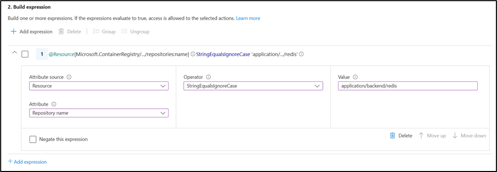

By setting up this condition, you ensure that the role assignee only has permissions to the repository `application/backend/redis`.

#### Scenario: Multiple ABAC conditions

ABAC supports multiple conditions for a single role assignment in order to grant permissions to various repositories.

1. Add the multiple ABAC conditions to grant permissions to specific repositories through `And` and `Or` operators.

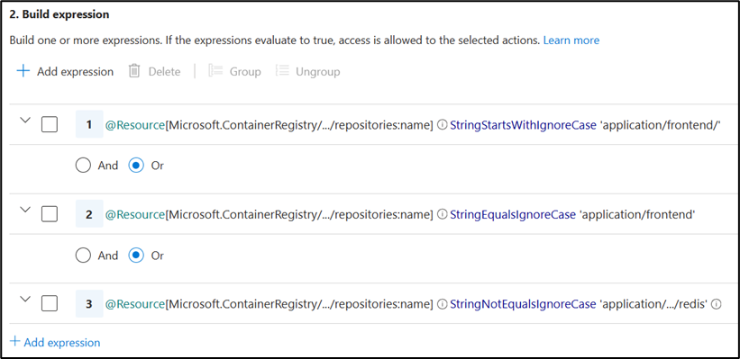

#### Scenario: Grouping and ordering multiple ABAC conditions

ABAC also supports grouping and ordering multiple conditions within expressions to grant permissions to specific repositories.

You can use the ABAC condition interface to group and order multiple conditions to fine-tune the evaluation of your conditional expressions.

To configure the precedence and evaluation order of ABAC conditions:

1. Specify the precedence of conditional expressions by changing the order in which ABAC conditions are evaluated.

2. Group multiple ABAC Conditions to control the evaluation order with more granularity.


#### Scenario: Restricting permissions with a negation rule

ABAC also supports negating conditions within expressions to grant permissions to repositories except for the one you specifically negate.

To create an ABAC rule that grants read permissions to all repositories except the `application/secret` repository, you can follow these steps:

1. Add a general read permission rule to define and grant read permissions to all repositories.
2. Create a negation rule that excludes `application/secret` from the general read permissions.
3. Ensure the negation rule is prioritized over the general read permission rule.

By following these steps, users will have read access to all repositories with the specific exclusion of `application/secret`.

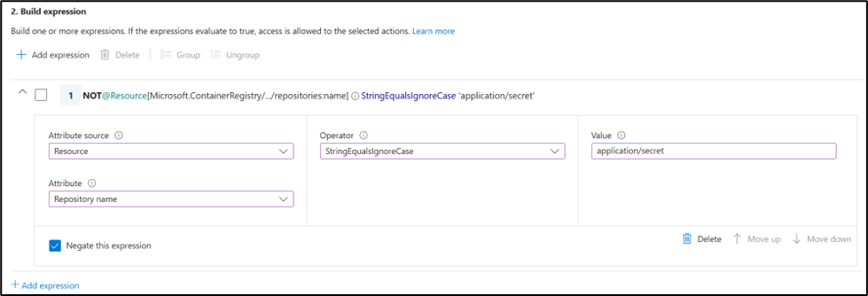

## Private Preview Limitations of ABAC-Enabled Repository Permissions

During the private preview of ABAC-enabled Repository Permissions, there are a few limitations that you should be aware of:

1. **ACR Tasks Permissions**: When a registry is opted into ABAC-enabled Repository Permissions, both new and existing ACR Tasks created within the ABAC-enabled registry will not be able to push or pull images from the registry. This is being addressed as the preview progresses. To see if your registry has been opted into ABAC-enabled Repository Permissions, run the following az cli command.

    ```bash
    az acr show -n MyRegistry --query roleAssignmentMode
    ```

If the roleAssignmentMode is set to `AbacRepositoryPermissions`, your registry is opted into ABAC-enabled Repository Permissions and thus ACR Tasks may have permission issues to the registry itself.

If the `roleAssignmentMode` is set to `LegacyRegistryPermissions`, your registry is not opted into ABAC-enabled Repository Permissions and thus ACR Tasks is unaffected.

## Conclusion

Azure Container Registry (ACR) Access-Based Access Control (ABAC) Repository Permissions is a powerful feature that enhances the security and access control of your container registry. By scoping permissions to specific repositories within your registry, you can ensure that users have access only to the resources they need, reducing the risk of unauthorized access and data breaches.
