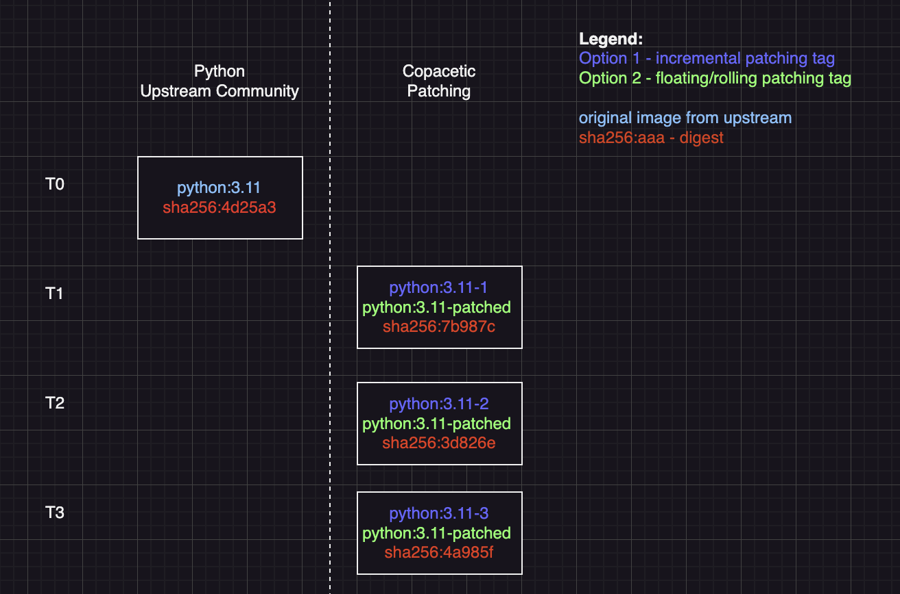
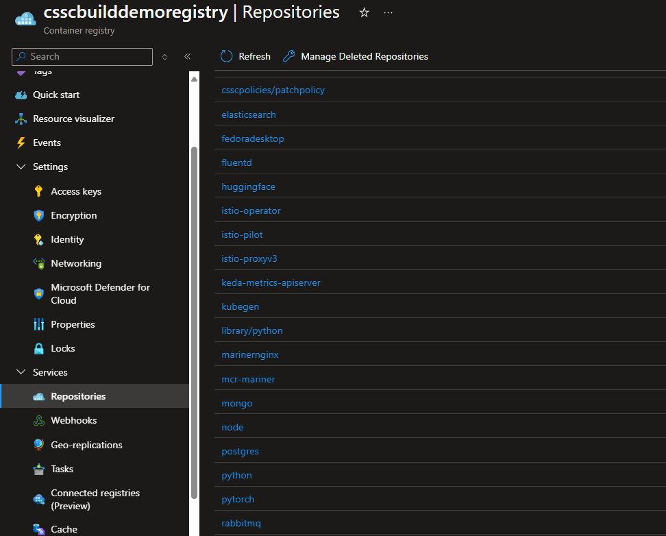
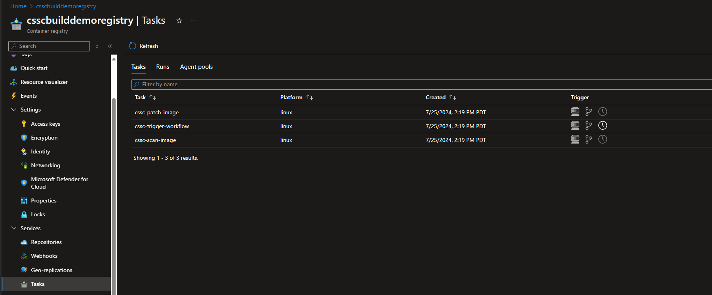
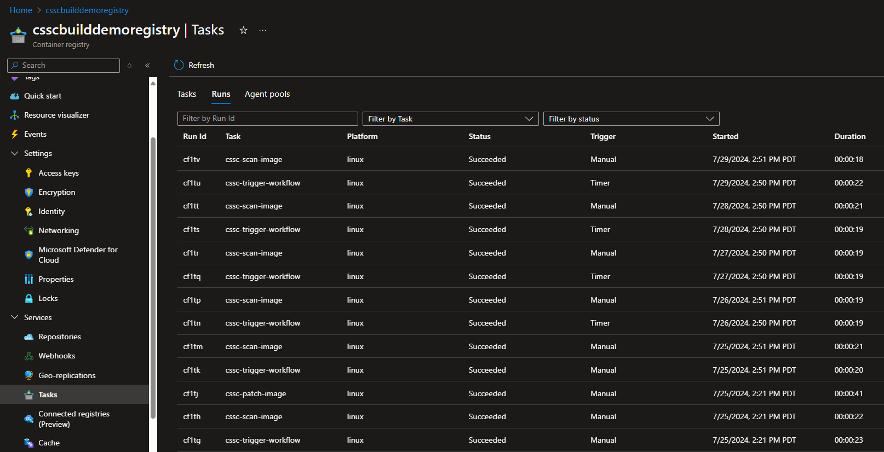

Continuous Patching Workflow in Azure Container Registry
========================================================

## Introduction

Azure Container Registry's Continuous Patching feature automates the detection and remediation of operating system(OS) level vulnerabilities in container images. By scheduling regular scans with [Trivy](https://trivy.dev/) and applying security fixes using [Copa](https://project-copacetic.github.io/copacetic/website/), you can maintain secure, up-to-date images in your registry—without requiring access to source code or build pipelines. Simply customize the schedule and target images to keep your Azure Container Registry(ACR) environment safe and compliant

> [!NOTE]
> Continuous Patching is in Private Preview as of October 2024.

## Use Cases

Here are a few scenarios to use Continuous Patching:

- **Enforcing container security and hygiene:** Continuous Patching enables users to quickly fix OS container CVEs without the need to fully rebuild from upstream.
- **Speed of Use:** Continuous Patching removes the dependency on upstream updates for specific images by updating packages automatically. Vulnerabilities can appear every day, while popular image publishers may only offer a new release once a month. With Continuous Patching, you can ensure that container images within your registry are patched as soon as the newest set of OS vulnerabilities are detected.

## Preview Limitations

Continuous Patching is currently in private preview. The following limitations apply:

- Windows-based container images aren't supported.
- Only "OS-level" vulnerabilities that originate from system packages will be patched. This includes system packages in the container image managed by an OS package manager such as "apt” and "yum”. Vulnerabilities that originate from application packages, such as packages used by programming languages like Go, Python, and NodeJS are unable to be patched.
- End of Service Life (EOSL) images are not supported by Continuous Patching. EOSL images refer to images where the underlying operating system is no longer offering updates, security patches, and technical support. Examples include images based on older operating system versions such as Debian 8 and Fedora 28. EOSL images will be skipped from the patch despite having vulnerabilities - the recommended approach is to upgrade your the underlying operating system of your image to a supported version.

## Prerequisites

- You can use the Azure Cloud Shell or a local installation of the Azure CLI with a minimum version of 2.15.0 or later.
- You have an existing Resource Group with an Azure Container Registry.
- You have an Azure Container Registry with Tasks enabled. (Tasks is not supported in the free tier of ACR)
- [Trivy](https://trivy.dev/latest/) requires a minimum installation version of 0.57.0 or higher.

## Key Concepts

Because Continuous Patching in ACR creates a new image per patch, ACR relies on a tag convention to version and identify patched images. The two main approaches are incremental and floating.

### Incremental Tagging

How It Works

Each new patch increments a numerical suffix (e.g., ``-1``, ``-2``, etc.) on the original tag. For instance, if the base image is python:3.11, the first patch creates ``python:3.11-1``, and a second patch on that same base tag creates ``python:3.11-2``.

Special Suffix Rules

- ``-1`` to ``-999``: These are considered patch tags.
- ``-x`` where ``x > 999``: These are not interpreted as patch tags; instead, that entire suffix is treated as part of the original tag. (Example: ``ubuntu:jammy-20240530`` is considered an original tag, not a patched one.)
  This means if you push a new tag ending in ``-1`` to ``-999`` by accident, Continuous Patching will treat it like a patched image. We recommend you to avoid pushing tags that you want patched with the suffix ``-1`` to ``-999``. If ``-999`` versions of a patched image is hit, Continuous Patching will return an error.

### Floating Tagging

How it works

A single mutable tag, ``-patched``, will always reference the latest patched version of your image. For instance, if your base image tag is ``python:3.11``, the first patch creates ``python:3.11-patched``. With each subsequent patche, the ``-patched`` tag will automatically update to point to the most recent patched version.



### Which Should I Use?

Incremental (**default**): Great for environments where auditability and rollbacks are critical, since each new patch is clearly identified with an unique tag.

Floating: Ideal if you prefer a single pointer to the latest patch for your CI/CD pipelines. Reduces complexity by removing the need to update references in downstream applications per patch, but sacrifices strict versioning, making it difficult to rollback.

## Installing the Continuous Patching Workflow

Run the following command to install the CLI extension:

```sh
az extension add --source https://acrcssc.z5.web.core.windows.net/acrcssc-1.1.1rc7-py3-none-any.whl
```

## Enable the Continuous Patching Workflow

To enable Continuous Patching, follow the series of steps below that outline the CLI process. These guidelines detail the lifecycle of a continuous patching workflow, from its creation to subsequent updates to eventual deletion.

1. Login to Azure CLI with az login

```sh
az login
```

2. Login to ACR

```sh
az acr login -n <myRegistry>
```

3. Run the following command to create a file named ``continuouspatching.json``, which contains the Continuous Patching JSON.

```sh
cat <<EOF > continuouspatching.json
{
    "version": "v1",
    "tag-convention" : "<incremental|floating>",
    "repositories": [{
        "repository": "<Repository Name>",
        "tags": ["<comma-separated-tags>"],   
        "enabled": <true|false>
    }] 
}
EOF
```

The schema ingests specific repositories and tags in an array format. Each variable is defined below:

- ``version`` allows the ACR team to track what schema version you're on. Do not change this variable unless instructed to.
- ``tag-convention`` this is an optional field. Allowed values are "incremental" or "floating" - refer to [Key Concepts](#key-concepts) for more information.
- ``repositories`` is an array that consists of all objects that detail repository and tag information

  - ``repository`` refers to repository name
  - ``tags`` is an array of tags separated by commas. The wildcard ``*`` can be used to signify all tags within that repository
  - ``enabled`` is a Boolean value of true or false determining if the specified repo is on or off

The following details an example configuration for a customer who wants to patch all tags (use the * symbol) within the repository ``python``, and to patch specifically the ``jammy-20240111`` and ``jammy-20240125`` tags in the repository ``ubuntu``.

JSON example:

```json
{
"version": "v1",
"tag-convention" : "incremental",
"repositories": [{
        "repository": "python",
        "tags": ["*"],
        "enabled": true
    },
    {
        "repository": "ubuntu",
        "tags": ["jammy-20240111", "jammy-20240125"],
        "enabled": true, 
    }]
}
```

4. After creating your configuration file, it is recommended to execute a dry run to verify the intended artifacts are selected by the JSON criteria. The dry run requires a parameter called ``schedule``, which specifies how often your continuous patching cycle will run. The schedule flag is measured in days, with a minimum value of 1 day, and a maximum value of 30 days. For example, if you want an image to be patched everyday, you would specify schedule as ``1d``, or 1 day. If you want a weekly patch (once a week), you would fill schedule as ``7d``, or 7 days.

Command Schema:

```sh
az acr supply-chain workflow create -r <registryname> -g <resourcegroupname> -t continuouspatchv1 --config <JSONfilepath> --schedule <number of days> --dry-run 
```

Example Command:

```sh
az acr supply-chain workflow create -r myRegistry -g myResourceGroup -t continuouspatchv1 -–config ./continuouspatching.json --schedule 1d –-dry-run   
```

The ``--dry-run`` flag will output all specified artifacts by the JSON file configuration. Customers can verify that the right artifacts are selected. With the sample ubuntu configuration above, the following results should be displayed as output.

```sh
Ubuntu: jammy-20240111
Ubuntu: jammy-20240125
```

Help command to see all required/optional flags.

```sh
az acr supply-chain workflow create --help
```

5. Once satisfied with the dry-run results, run the ``create`` command again without the ``--dry-run`` flag to officially create your continuous patching workflow.

**Important**

The ``--schedule`` parameter follows a fixed-day multiplier starting from day 1 of the month. This means:

- If you specify ``--schedule 7d`` and run the command on the 3rd, the next scheduled run will be on the 7th—because 7 is the first multiple of 7 (days) after the 3rd, counting from day 1 of the month.
- If ``--schedule`` is 3d and today is the 7th, then the next scheduled run lands on the 9th—since 9 is the next multiple of 3 that follows 7.
- If you add the flag ``--run-immediately``, you trigger an immediate patch run. The subsequent scheduled run will still be aligned to the nearest day multiple from the 1st of the month, based on your ``--schedule`` value.
- The schedule counter **resets** every month. Regardless of the designated schedule, your workflow will run on the 1st of every month, then follow the specified schedule value for the remainder of the month. If my patching runs on the 28th of January, and my schedule is 7d, my next patch will run on Feburary 1st, then 8th, and continue following the 7 days.

Command Schema:

```sh
az acr supply-chain workflow create -r <registryname> -g <resourcegroupname> -t continuouspatchv1 -–config <JSONfilename> --schedule <number of days> --run-immediately
```

Example Command:

```sh
az acr supply-chain workflow create -r myRegistry -g myResourceGroup -t continuouspatchv1 -–config ./continuouspatching.json --schedule 1d --run-immediately
```

Upon a successful command (whether or not you include ``--run-immediately``), you will see:

- A success message confirming that your workflow tasks have been queued.
- An output parameter indicating when the next run of your workflow is scheduled, so you can track exactly when patching will occur again.

Help command to see all required/optional flags.

```sh
az acr supply-chain workflow create --help
```

## Use Azure Portal to view workflow tasks

Once the workflow succeeds, go to the Azure Portal to view your running tasks. Click into Services -> Repositories, and you should see a new repository named ``csscpolicies/patchpolicy``. This repository hosts the JSON configuration artifact that will be continuously referenced for continuous patching.



Next, click on "Tasks” under "Services”. You should see 3 new tasks, named the following:



- cssc-trigger-workflow – this task scans the configuration file and calls the scan task on each respective image.
- cssc-scan-image – this task scans the image for operating system vulnerabilities. This task will only trigger the patching task only if (1) operating system vulnerabilities were found, and (2) the image is not considered End of Service Life (EOSL). For more information on EOSL, please consult [Preview Limitations](#preview-limitations).
- cssc-patch-image – this task patches the image.
  These tasks work in conjunction to execute your continuous patching workflow.

You can also click on "Runs” within the "Tasks” view to see specific task runs. Here you can view status information on whether the task succeeded or failed, along with viewing a debug log.



## Use CLI to view workflow tasks

You can also run the following CLI show command to see more details on each task and the general workflow. The command will output

- Schedule
- Creation date
- System data such as last modified date, by who, etc.

Command Schema

```sh
az acr supply-chain workflow show -r <registry> -g <resourceGroup> -t continuouspatchv1   
```

Example Command

```sh
az acr supply-chain workflow show -r myRegistry -g myResourceGroup -t continuouspatchv1 
```

Help command to see all required/optional flags

```sh
az acr supply-chain workflow show --help
```

## Updating the Continuous Patching Workflow

In scenarios where you want to make edits to your continuous patching workflow, the update command is the easiest way to do so. You can update your schedule or JSON config schema with the update CLI command directly.

Command Schema

```sh
az acr supply-chain workflow update -r <registry> -g <resourceGroup> -t continuouspatchv1 --config <JSONfilename> --schedule <number of days>
```

Example Command

```sh
az acr supply-chain workflow update -r myRegistry -g myResourceGroup -t continuouspatchv1 --config ./continuouspatching.json --schedule 1d
```

Help command to see all required/optional flags

```sh
az acr supply-chain workflow update --help
```

To update your schedule, run the previous command with a new input for schedule. To update your JSON configuration, we recommend making changes to the file, running a dry-run, and running the update command.

You can verify the updated workflow configuration by running the following show command or by clicking into your registry portal view.

```sh
az acr supply-chain workflow show -r myregistry -g myresourcegroup -t continuouspatchv1
```

## Deleting the Continuous Patching Workflow

To delete the continuous patching workflow, please run the following CLI command

Command Schema

```sh
az acr supply-chain workflow delete -r <registry> -g <resourceGroup> -t continuouspatchv1 
```

Example Command

```sh
az acr supply-chain workflow delete -r myregistry -g myresourcegroup –t continuouspatchv1
```

Help command to see all required/optional flags

```sh
az acr supply-chain workflow delete --help
```

Once a workflow is successfully deleted, the repository "csscpolicies/patchpolicy” will be automatically deleted. The 3 tasks that run your workflow will also be automatically deleted, along with any currently queued runs and previous logs.

## Listing Running Tasks

To list the most recently executed Continuous Patching tasks, the following List command is available:

```sh
az acr supply-chain workflow list -r <registryname> -g <resourcegroup> [–-run-status <failed || successful || running>] -t continuouspatchv1
```

A successful result will return the following information:

- Image name and tag
- Workflow type
- Scan status
- Last scan date and time (if status failed, date would be left blank)
- Scan task ID (for further debugging)
- Patch Status
- Last patch date and time (if status failed, date would be left blank)
- Patched image name + tag
- Patch task ID (for further debugging)

Example

```sh
ubuntu:jammy-20240111
scan status: successful
scan date: 2024-07-02T14:02:00
scan task ID: abc
patch status: successful
patch date: 2024-07-02T14:04:00
patch task id: def
patched image: ubuntu:jammy-20240111-1
workflow type: continuouspatchv1
```

The [--run-status] will return all tasks statuses that match the specified filter. This CLI command provides important debugging information.

For example, If the "failed" value is specified under run-status, only images which have failed their patching will be listed.

See Appendix for a full list of possible outputs.

## Canceling Running Tasks

Certain scenarios may require you to cancel tasks which are currently running or waiting to run. For this purpose, please run the following CLI command:

```sh
az acr supply-chain workflow cancel-run -r <registryname> -g <resourcegroup> --type <continuouspatchv1>
```

This command will cancel all Continuous Patching tasks within the registry with a status of "Running”, "Queued” and "Started”. The command will output a success or failure. Failure results will follow the failure pattern of the other workflow commands if the input is incorrect.
Running the cancel command will only affect tasks in the current schedule.

For example, if a user has their schedule for 1d, and runs the cancel command, tasks in those 3 states will be canceled for that day, but will be requeued for the next day. If the schedule was a week, then that week's tasks would be canceled, but the following week would have the tasks requeued. The main scenario for this command is when a user misconfigures their continuous patching workflow and doesn't want to wait for all tasks to finish running.

## Troubleshooting Tips

Use the task list command to output all failed tasks. Specifying the "cssc-patch” command is best for failure. The documentation on the task-list [command](https://learn.microsoft.com/en-us/cli/azure/acr/task?view=azure-cli-latest#az-acr-task-list-runs) is here.

Task-list command for top 10 failed patch tasks

```sh
az acr task list-runs -r registryname -n cssc-patch-image --run-status Failed --top 10
```

This command will output all failed tasks. To investigate a specific failure, grab the runID that's outputted from this command and run

```sh
az acr task logs -r registryname --run-id <run-id>
```

If the logs aren't sufficient, or an issue is persistent, or for any feedback, please email the ACR team at acr-patching-preview@microsoft.com

## Appendix

**Possible CLI Outputs for 'List' Command**

```sh
az acr supply-chain workflow list -r <registryname> -g <resourcegroup> [–-run-status <Failed || Queued || Running || Skipped || Succeeded || Unknown>]
```

If scan and patch are successful

```sh
image: import:dotnetapp-manual
        scan status: Succeeded
        scan date: 2024-09-13 21:05:58.841962+00:00
        scan task ID: dt21
        patch status: Succeeded
        patch date: 2024-09-13 21:07:32.841962+00:00
        patch task ID: xyz2
        last patched image: import:dotnetapp-manual-patched
        workflow type: continuouspatchv1
```

If scan is successful but patch isn't (with a previous patched image available)

```sh
image: import:dotnetapp-manual
        scan status: Succeeded
        scan date: 2024-09-13 21:05:58.841962+00:00
        scan task ID: dt21
        patch status: Failed
        patch date: 2024-09-13 21:07:32.841962+00:00
        patch task ID: xyz2
        last patched image: import:dotnetapp-manual-patched
        workflow type: continuouspatchv1
```

If scan is successful but patch isn't (with NO previous patched image available)

```sh
image: import:dotnetapp-manual
        scan status: Succeeded
        scan date: 2024-09-13 21:05:58.841962+00:00
        scan task ID: dt21
        patch status: Failed
        patch date: 2024-09-13 21:07:32.841962+00:00
        patch task ID: xyz2
        last patched image: ---No patch image available---
        workflow type: continuouspatchv1
```

If scan is successful and no patch is needed (no OS vulnerabilities found)

```sh
image: import:dotnetapp-manual
        scan status: Succeeded
        scan date: 2024-09-13 21:05:58.841962+00:00
        scan task ID: dt21
        patch status: Skipped
        skipped patch reason: no vulnerability found in the image import:dotnetapp-manual image: 
        patch date: ---Not Available---
        patch task ID: ---Not Available---
        last patched image: import:dotnetapp-manual-patched
        workflow type: continuouspatchv1
```

if scan is successful and no patch is needed and NO patched image exists yet

```sh
image: import:dotnetapp-manual
        scan status: Succeeded
        scan date: 2024-09-13 21:05:58.841962+00:00
        scan task ID: dt21
        patch status: Skipped
        skipped patch reason: no vulnerability found in the image import:dotnetapp-manual image: 
        patch date: ---Not Available---
        patch task ID: ---Not Available---
        last patched image: ---Not Available---
        workflow type: continuouspatchv1
```

If scan is a failure and a patched image exists

```sh
image: import:dotnetapp-manual
        scan status: Failed
        scan date: 2024-09-13 21:05:58.841962+00:00
        scan task ID: dt21
        patch status: ---Not Available---
        patch date: ---Not Available---
        patch task ID: ---Not Available---
        last patched image: import:dotnetapp-manual-patched
        workflow type: continuouspatchv1
```

If scan is a failure and NO previous patched image exists

```sh
image: import:dotnetapp-manual
        scan status: Failed
        scan date: 2024-09-13 21:05:58.841962+00:00
        scan task ID: dt21
        patch status: ---Not Available---
        patch date: ---Not Available---
        patch task ID: ---Not Available---
        last patched image: ---Not Available---
        workflow type: continuouspatchv1
```

If scan is currently running and a patched image exists

```sh
image: import:dotnetapp-manual
        scan status: Running
        scan date: 2024-09-13 21:05:58.841962+00:00
        scan task ID: dt21
        patch status: ---Not Available---
        patch date: ---Not Available---
        patch task ID: ---Not Available---
        last patched image: import:dotnetapp-manual-patched
        workflow type: continuouspatchv1
```

If scan is currently running and NO patched image exists

```sh
image: import:dotnetapp-manual
        scan status: Running
        scan date: 2024-09-13 21:05:58.841962+00:00
        scan task ID: dt21
        patch status: ---Not Available---
        patch date: ---Not Available---
        patch task ID: ---Not Available---
        last patched image: ---Not Available---
        workflow type: continuouspatchv1
```

If patch is currently running and a patched image exists

```sh
image: import:dotnetapp-manual
        scan status: Succeeded
        scan date: 2024-09-13 21:05:58.841962+00:00
        scan task ID: dt21
        patch status: Running
        patch date: 2024-09-13 21:07:32.841962+00:00
        patch task ID: xyz2
        last patched image: import:dotnetapp-manual-patched
        workflow type: continuouspatchv1
```

If patch is currently running and NO patched image exists

```sh
image: import:dotnetapp-manual
        scan status: Succeeded
        scan date: 2024-09-13 21:05:58.841962+00:00
        scan task ID: dt21
        patch status: Running
        patch date: 2024-09-13 21:07:32.841962+00:00
        patch task ID: xyz2
        last patched image: ---Not Available---
        workflow type: continuouspatchv1
```
