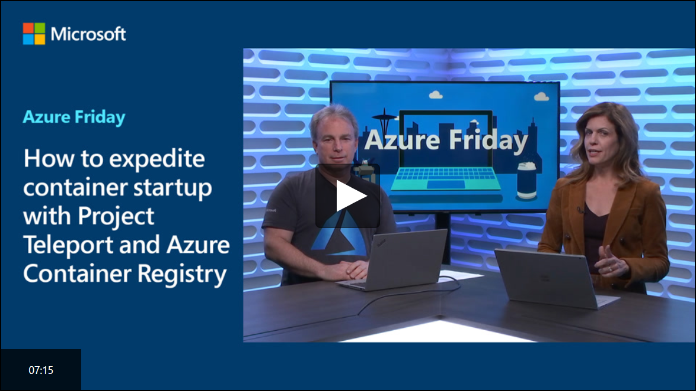
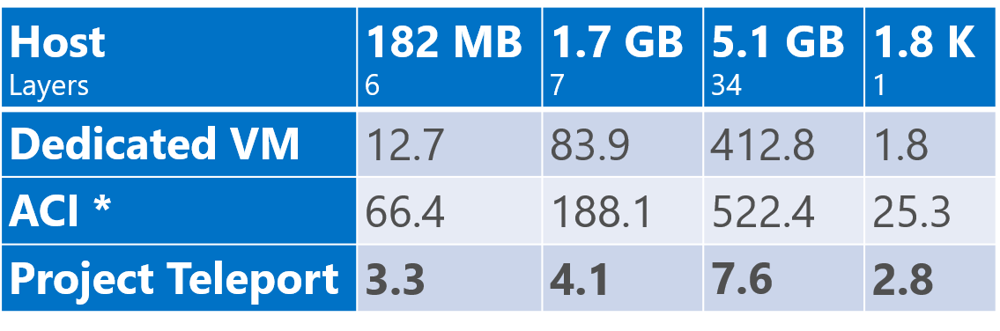

# Project Teleport Overview (Private Preview)

Instancing a custom environment within seconds is one of the many wonders of running containers. Having to wait for the image and its layers to download & decompress the first time is the current price of admission.

***Project Teleport removes the cost of download and decompression by mounting pre-expanded layers from the Azure Container Registry to Teleport enabled Azure container hosts.***

|Dedicated VM|Teleport w/ACR Tasks |
|-|-|
|||

[](https://channel9.msdn.com/Shows/Azure-Friday/How-to-expedite-container-startup-with-Project-Teleport-and-Azure-Container-Registry/player#time=21s)


> For more background, please see [Azure Container Registry Adds Teleportation][teleport-blog-post]

## Table of Contents

- [Sign Up for the Project Teleport Preview](#sign-up-for-the-project-teleport-preview)
- [Supported Services](#supported-services)
- [Preview Constraints](#preview-constraints)
- [Getting Started with Teleportation](./getting-started.md)
- [Getting Support](#getting-support)

## Sign Up for the Project Teleport Preview

In these early stages, we're looking for direct feedback. To request access, please sign up here: [aka.ms/teleport/signup][signup]

## Supported Services

- ~~Preview 1 focused on running containers within [ACR Tasks][acr-tasks].~~
- Preview 2 focuses on running containers within [AKS][aks]. See: [Getting Started with AKS][aks-getting-started]

Additional services and scenarios will come online as we incorporate more feedback.

## Preview Constraints

Preview 2 has the following constraints. Your feedback will help us prioritize this list.

- Limited to running images with [AKS][aks-getting-started]
- Support for [premium registries][acr-tiers]
- Registries must exist in the following regions:
    | Region | Code |
    | - | - |
    | East US | EUS |
    | East US 2 | EUS2 |
    | South Central US | SCUS |
    | West US | WUS |
    | West US 2 | WUS2 |
    | West Europe | WEU |
  - Additional regions, including other continents will come online as we get more feedback.
- [Geo-replication](https://aka.ms/acr/geo-replication): For preview 2, only the master region of a geo-replicated registry will support teleportation.
  - Replica regions will function as normal, pulling compressed blobs.
- Linux images are currently supported with Windows images coming in a future release.
- [ACR Webhook Push notifications][webhooks] occur when the image manifest and compressed blobs are completed. However, layer expansion will take several additional seconds, depending on the size and quantity of layers. We are considering various options when layer expansion has completed within each region, including regionalized `layer-expanded` notifications and enhancements to `az acr repository show`. For now, a `check-expansion.sh` script is provided.

## Getting Support

- [Logging Project Teleport related issues](https://github.com/AzureCR/teleport/issues)
- [Feature Requests via User Voice](https://aka.ms/acr/uservoice)
- [Contact the ACR Product Team](https://github.com/Azure/acr/blob/master/README.md#providing-feedback)

## How Do I...

- **Q:** run some baseline Project Teleport examples
  - **A:** [Getting Started with AKS][aks-getting-started]
- **Q:** know when an image is expanded, and ready for teleportation?
  - **A:** ACR will support a new notification event, as well as CLI support. For Preview 2, you can run the following script, passing in 3 arguments for each image you'd like to check, with credentials saved to environment variables.

  ```sh
  ./check-expansion.sh [registryName] [repoName] [tag] [optional: --debug]
  ./check-expansion.sh demo42t hello-world 1.0 --debug
  ```

- **Q:** know if a repository is enabled for teleportation?
  - **A:** Project Teleport must be enabled by the ACR Product team. To verify a repository is enabled, use `az acr repository show`, looking for the `teleportEnabled` attribute.

  ```sh
  az acr repository show \
    --repository azure-vote-front \
    -o jsonc
  {
  "changeableAttributes": {
    "deleteEnabled": true,
    "listEnabled": true,
    "readEnabled": true,
    "teleportEnabled": true,
    "writeEnabled": true
  ```

[acr-import]:           https://aka.ms/acr/import
[acr-tiers]:            https://aka.ms/acr/tiers
[aks]:                  https://azure.microsoft.com/services/kubernetes-service/
[aks-getting-started]:  ./aks-getting-started.md
[cloud-shell]:          https://shell.azure.com
[signup]:               https://aka.ms/teleport/signup
[support]:              https://github.com/azurecr/teleport/blob/master/README.md#getting-support
[teleport-blog-post]:   https://stevelasker.blog/2019/10/29/azure-container-registry-teleportation/
[acr-tasks]:            https://aka.ms/acr/tasks
[webhooks]:             https://docs.microsoft.com/en-us/azure/container-registry/container-registry-webhook
