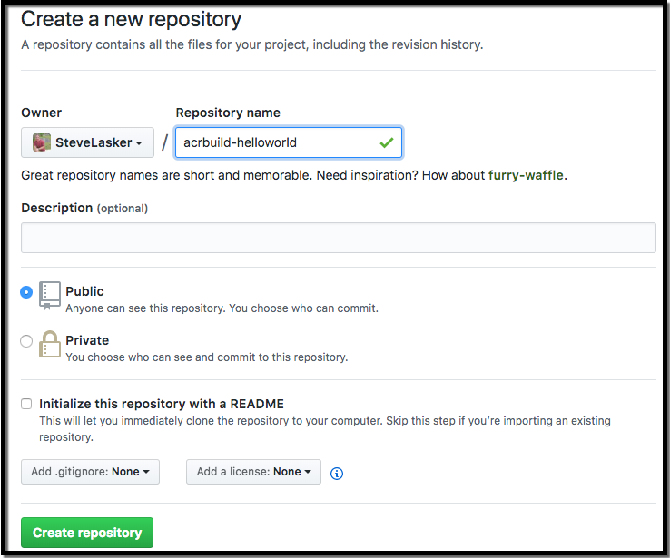
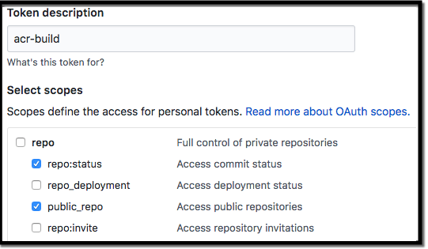

# Tutorial: Create a build-task with base image updates
> NOTE: Base image updates are coming in a future preview. This quickstart outlines the initial goal. Subsequent iterations on base image updates will support an update-task to fork a released image with OS & Framework patching, while you continue to iterate on the build-task.

Azure container registry supports a native container build service that can be triggered by source code commits or base image updates. When images are deployed, and developers are no longer making commits, deployments are patched and maintained by rebuilding, testing and redeploying images. As a base image is updated, build-tasks can be triggered, creating an updated image. 

In this tutorial:

> [!div class="checklist"]
> * Create an Azure Container Registry
> * Create a base image in the registry, used for base image updates
> * Clone a sample repo
> * Create a build-task to host the build definition
> * Make a git-commit to demonstrate a code change triggered build
> * Make a change to the base image to demonstrate a OS & Framework patching build


## Before you begin

This tutorial requires that you are running the Azure CLI version 2.0.29 or later. Run `az --version` to find the version. See [Install Azure CLI 2.0](https://docs.microsoft.com/en-us/cli/azure/install-azure-cli) to install or upgrade your CLI.

Install the preview [az acr build](../install.md) extension

> This tutorial can be done in Azure Cloud Shell

## Create a container registry

Using the az cli, run the following commands. 

Throughout the rest of this tutorial, we use `$ACR_NAME` as a placeholder for the **container registry name** that you chose. Replace jengademos with a globally unique name.

```bash
export ACR_NAME=jengademos
export REGISTRY_NAME=$ACR_NAME.azurecr.io/
az group create -l eastus -g $ACR_NAME
az acr create -g $ACR_NAME --sku Standard -n $ACR_NAME
```

## Create a base image

Clone the sample, which includes:

- A dockerfile representing a base image
- A sample hellowworld app used for demonstrating base image updates

```sh
git clone https://github.com/SteveLasker/acrbuild-node-helloworld.git
```

Build the base image, then push to the registry

```sh
az acr build -t baseimages/node:9 -f nodeDockerfile .
```

## Create the hello world image, from the base image

Using the coprimages/node image, we'll create a helloworld sample that we'll update.

```bash
az acr build -t helloworld:{{.Build.Id}} --build-arg REGISTRY_NAME=$REGISTRY_NAME -c . -r $ACR_NAME 
```
Get the build id
```sh
BUILD_ID=[value from above]
```

Run the sample 
```sh
docker run -d -p 80:5000 ${REGISTRY_NAME}helloworld:[buildId]
```

We can now see our sample outputs a version environment variable from the base image
```html
Hello World
Version: 9.10.0
```

## Host the sample on a github repo
To get the full code commit, base image update trigger experience, setup the hello world app in a github repo. 

Create a [new github repo](https://github.com/new)

Name the repo **acrbuild-helloworld**
 

Push the helloworld app to github
```bash
git remote add origin https://github.com/[yourAccount]/acrbuild-helloworld.git
git push -u origin master
```

## Create a build-task for helloworld
> ACR Build currently supports github based PAT tokens. VSTS tokens will come in a future preview

Create a github token by navigating to: 
    https://github.com/settings/tokens/new

Under repo, enable repo:status, public_repo



Save the generated token
```
export REPO=[yourGithubRepo]
export PAT=[yourToken]
```

Create a build task, which is automatically triggered on scc commits. 

With the git PAT, execute the following command replacing the context with your github repo and token

```
az acr build-task create --name helloworld -r $ACR_NAME \
    -t helloworld:{{.Build.Id}} \
    --build-args REGISTRY_NAME=$REGISTRY_NAME \
    --context https://github.com/$REPO/acrbuild-helloworld --git-access-token $PAT
```

## Manually trigger the build definition

```
az acr build-task run -n helloworld -r $ACR_NAME
```

## Trigger a build with a code change
Make a minor change to the helloworld app

Change server.js from:
```bash
response.write('Hello World\n')
```
to
```bash
response.write('Hello World now\n')
```

Push the change github

```bash
git push 
```

## List the tags for the image
```bash
az acr repository show-tags --repository helloworld -n $ACR_NAME
```

## View the logs as **acr build** begins

```bash
az acr build-task logs -r $ACR_NAME
```

`build-task logs` will display the most recent log, including one that's currently running. This allows us to see the git commit triggered a build

## Trigger a build with a base image update

Edit **nodeDockerfile** to bump the version with an **a**

```bash
ENV NODE_VERSION 9.10.0a
```

Build a base image, that you maintain and push to the registry. Note, we continue to use the stable tag of 9, as we're doing an OS and/or Framework update.

> See [Docker Tagging: Best practices for tagging and versioning docker imagese](https://blogs.msdn.microsoft.com/stevelasker/2018/03/01/docker-tagging-best-practices-for-tagging-and-versioning-docker-images/) for info on stable and unique tagging.

```bash
docker build -t ${REGISTRY_NAME}baseimages/node:9 -f nodeDockerfile .
docker push ${REGISTRY_NAME}baseimages/node:9
```

View the logs as the base image update triggers the **helloworld** build task. Watch the build-id as it may take a moment for the notification to trigger the build.
```bash
az acr build-task logs -r $ACR_NAME
```

## Run the newly built image
Once the image is built using `acr build`, run the image locally to see the change.
Paste the value of build id from the log into the docker run command

```bash
docker run -d -p 80:5000 ${REGISTRY_NAME}helloworld:[build id]
```

## Base image updates from other locations
ACR Build will support base image update notifications from Docker Hub as well as other Azure Container Registries. The current preview is limited to base image update notifications from the same registry.

Base Image Update notifications are also currently limited to the runtime dependency. In a future preview, `acr build-task create` will expose parameters for which base image dependencies to monitor, including not monitoring. 

## Next steps

In this tutorial, you created a build-task to monitor git commits as well as base image updates. These primitives support OS & Framework Patching scenarios, enabling developers to quickly iterate while still in their inner-loop. While setting their build system to support the longevity of their production apps. 

> [!div class="checklist"]
> * Create an Azure Container Registry
> * Create a base image in the registry, used for base image updates
> * Clone a sample repo
> * Create a build-task to host the build definition
> * Make a git-commit to demonstrate a code change triggered build
> * Make a change to the base image to demonstrate a OS & Framework patching build

Advance to the next tutorial to learn about update-tasks that enable developers to iterate on a build-task while a deployed image will receive base image updates.

> [!div class="nextstepaction"]
> [coming soon](quickstart-updatetask.md)
